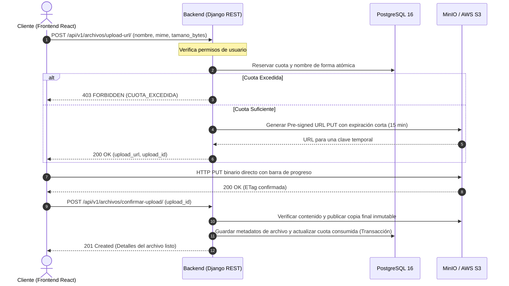

# Contrato Completo y Unificado de la API de CloudVault

**IMPLEMENTADO** significa encontrado en el código revisado, no certificado como desplegado. **PROPUESTO** significa especificación para implementar, aunque su regla de producto ya esté aprobada. **FUTURO** identifica 2FA, fuera de esta entrega. Cada módulo conserva su estado hasta cumplir sus criterios de aceptación.

### Autoridad del esquema y decisiones de producto

1. El esquema SQL adjunto es la verdad definitiva de la persistencia existente. Coincide, salvo el salto final, con `database/schema.sql` de `feature/auth-custom-user-jwt`, commit `fce7960449efd13059493314884d7affbb25b19a`. SHA-256 del adjunto: `803d9d3606822566e6d37d96534452d7b78e10897bc54ac2dcf2c4a1b0322c95`.
2. El catálogo inicial se toma de `database/seeds.sql` del mismo commit: **tres planes**, con sus IDs, nombres, capacidades y precios originales. La base desplegada no se consultó en esta revisión; al implementar se verificará que sus datos coincidan con el seed aprobado.
3. Las decisiones expresas del usuario de esta revisión fijan el resultado esperado: ingreso con plan gratuito, superusuario global, roles y ACL, almacenamiento de cualquier formato, preview restringido, papelera y pagos simulados, cierre inmediato de sesión, MinIO y recuperación por correo. Si necesitan columnas o tablas ausentes, se documentan como **ampliación pendiente**, nunca como parte del SQL actual.
4. `PropuestaSoftwareIv2.docx` aporta el alcance y arquitectura. Sus diferencias con el SQL, incluidas referencias a cuatro planes, no sustituyen el esquema ni el seed. Los identificadores RF/RNF conservan la organización del contrato anterior; no implican que todos aparezcan numerados en el DOCX.
5. Los detalles no fijados en SQL ni por el usuario se establecen aquí como **diseño técnico propuesto**: límites operativos, intervalos, sesiones, idempotencia, formatos de respuesta y políticas de ejecución. No se presentan como restricciones ya existentes en PostgreSQL.

Este documento mantiene las siete secciones y el formato del contrato anterior. La versión anterior permanece en los cambios guardados de Git; no se aplicó ni se modificó ese guardado. La referencia de trabajo resultante es `docs/final/CONTRATO_API.md`.

### Estado verificado y fuentes

Backend contrastado en `feature/backend-project-setup`, commit `e87c220b9ba45244d3891df46e575b6167a3a139`. La carpeta de trabajo estaba en `feature/frontend-project-setup`; se leyeron las otras ramas sin cambiarlas. Fuentes: esquema adjunto, seed de autenticación, propuesta Word, rutas, serializers, servicios, configuración y frontend existentes. No se inspeccionaron secretos de entorno ni se ejecutaron cambios sobre Railway.

| Alcance | Estado en la rama `feature/backend-project-setup` |
|---|---|
| Registro, login y recuperación por palabra secreta | **IMPLEMENTADO**: tres rutas POST en `backend/auth_workspaces/urls.py`. |
| Swagger y esquema OpenAPI | **IMPLEMENTADO**: `/api/docs/` y `/api/schema/`. |
| Verificación JWT y revocación de access tras cambiar contraseña | **IMPLEMENTADO** como componente; todavía no hay endpoints de negocio protegidos en el router. |
| Refresh, logout, perfil, cambio autenticado, correo de recuperación y organizaciones | **PROPUESTO**: no existen rutas ejecutables. |
| Storage, sharing, subscriptions y admin | **PROPUESTO**: no existen vistas ni modelos de estos módulos en esta rama. |
| 2FA | **FUTURO**: campos en el modelo; el login actual rechaza cuentas con 2FA habilitado. |

---

## Tabla de Contenidos

1. [Estándares Globales de la API](#1-estándares-globales-de-la-api)
   - [Envoltorio de Respuesta (Envelope)](#envoltorio-de-respuesta-envelope)
   - [Autenticación y Seguridad](#autenticación-y-seguridad)
   - [Paginación Estándar](#paginación-estándar)
   - [Códigos de Estado HTTP y Formato de Errores](#códigos-de-estado-http-y-formato-de-errores)
   - [Límites de Peticiones (Throttling)](#límites-de-peticiones-throttling)
2. [Módulo 1: Usuarios, Autenticación y Workspaces (`auth_workspaces`)](#2-módulo-1-usuarios-autenticación-y-workspaces-auth_workspaces)
   - [RF-01 — Registro de Usuario](#rf-01--registro-de-usuario)
   - [RF-02 — Inicio de Sesión](#rf-02--inicio-de-sesión)
   - [Renovación de Tokens JWT](#renovación-de-tokens-jwt)
   - [Cierre de Sesión (Logout)](#cierre-de-sesión-logout)
   - [RF-03 — Recuperación de Contraseña (Palabra Secreta)](#rf-03--recuperación-de-contraseña-palabra-secreta)
   - [RF-03 — Recuperación de Contraseña (Enlace Temporal por Correo)](#rf-03--recuperación-de-contraseña-enlace-temporal-por-correo)
   - [RF-04 — Perfil y Modificación de Cuenta](#rf-04--perfil-y-modificación-de-cuenta)
   - [RF-04 — Cambio Autenticado de Contraseña](#rf-04--cambio-autenticado-de-contraseña)
   - [RF-05 — Organizaciones y Roles Empresariales (RBAC)](#rf-05--organizaciones-y-roles-empresariales-rbac)
   - [Autenticación de Dos Factores (2FA) - Fase Futura](#autenticación-de-dos-factores-2fa---fase-futura)
3. [Módulo 2: Almacenamiento, Carpetas y Archivos (`storage`)](#3-módulo-2-almacenamiento-carpetas-y-archivos-storage)
   - [RF-07 — Gestión Jerárquica de Carpetas](#rf-07--gestión-jerárquica-de-carpetas)
   - [RNF-03 / RF-06 — Flujo de Subida Desacoplada con Pre-signed URLs](#rnf-03--rf-06--flujo-de-subida-desacoplada-con-pre-signed-urls)
   - [RF-06 — Gestión de Archivos (Metadatos, Renombrar, Mover)](#rf-06--gestión-de-archivos-metadatos-renombrar-mover)
   - [RF-06 / RF-08 — Descarga y Vista Previa Nativa](#rf-06--rf-08--descarga-y-vista-previa-nativa)
   - [RF-06 — Papelera Lógica y Retención de 30 Días](#rf-06--papelera-lógica-y-retención-de-30-días)
4. [Módulo 3: Compartición, Enlaces Públicos y ACL (`sharing`)](#4-módulo-3-compartición-enlaces-públicos-y-acl-sharing)
   - [RF-09 — Enlaces Públicos con Expiración y Contraseña](#rf-09--enlaces-públicos-con-expiración-y-contraseña)
   - [RF-09 — Acceso Público para Visitantes (Sin JWT)](#rf-09--acceso-público-para-visitantes-sin-jwt)
   - [RF-10 — Control de Acceso Interno (ACL)](#rf-10--control-de-acceso-interno-acl)
5. [Módulo 4: Suscripciones, Pagos y Control de Cuotas (`subscriptions`)](#5-módulo-4-suscripciones-pagos-y-control-de-cuotas-subscriptions)
   - [RF-11 — Catálogo de Planes de Suscripción](#rf-11--catálogo-de-planes-de-suscripción)
   - [RF-11 / RF-12 — Gestión de Suscripción del Usuario/Organización](#rf-11--rf-12--gestión-de-suscripción-del-usuarioorganización)
   - [RF-12 — Ciclo de Pagos y Simulación](#rf-12--ciclo-de-pagos-y-simulación)
   - [RF-13 — Control y Auditoría de Cuotas de Almacenamiento](#rf-13--control-y-auditoría-de-cuotas-de-almacenamiento)
6. [Módulo 5: Panel Administrativo y Métricas (`admin`)](#6-módulo-5-panel-administrativo-y-métricas-admin)
   - [RF-14 — Dashboard de Métricas y Estadísticas Globales](#rf-14--dashboard-de-métricas-y-estadísticas-globales)
   - [RF-14 — Supervisión Administrativa de Usuarios y Almacenamiento](#rf-14--supervisión-administrativa-de-usuarios-y-almacenamiento)
7. [Catálogo de Códigos de Error de la API](#7-catálogo-de-códigos-de-error-de-la-api)
   - [Diccionario SQL y API](#diccionario-de-campos-y-proyecciones-del-sql)
   - [Matriz de rutas](#matriz-de-rutas-para-implementación)
   - [Ampliaciones de persistencia](#dependencias-de-persistencia-antes-de-implementar-la-expansión)
   - [Parámetros operativos](#parámetros-operativos-del-diseño-final)
   - [Auditoría y transacciones](#auditoría-por-acción-y-transacciones)
   - [Infraestructura pendiente](#infraestructura-y-configuración-de-entrega)
   - [Ruta de implementación y pruebas](#ruta-de-implementación-y-criterios-de-aceptación)

---

## 1. Estándares Globales de la API

### URL Base

- **Desarrollo local:** `http://127.0.0.1:8000/api/v1`
- **Producción / staging:** dominio pendiente de confirmar. Tener PostgreSQL en Railway no implica que la API esté desplegada. `https://api.cloudvault.example/api/v1` se usa solo como marcador.
- **Documentación Swagger / OpenAPI:** `/api/docs/` (esquema en `/api/schema/`)
- Todas las rutas terminan en `/`. El puerto local puede cambiar al iniciar el servidor (por ejemplo, 8765); el frontend debe configurarlo mediante su URL base. No depender de redirecciones de POST.
- HTTP solo para desarrollo local explícito con `DJANGO_DEBUG=True`. El backend actual redirige a HTTPS cuando DEBUG es falso; el despliegue debe configurar correctamente el proxy y los orígenes CORS.

### Encabezados Requeridos

- `Content-Type: application/json` para solicitudes con cuerpo (a excepción de las subidas binarias directas a MinIO/S3).
- `Authorization: Bearer <access_token>` para todos los endpoints protegidos.

### Envoltorio de Respuesta (Envelope)

#### Respuestas Exitosas

Las operaciones individuales devuelven `data`, `mensaje`, o ambos si se especifica expresamente. Los listados paginados utilizan el sobre de paginación descrito abajo; Swagger/OpenAPI y las transferencias S3 tienen su propio formato:

```json
{
  "data": {
    "id": "6b3b2489-1353-4d73-a6cb-c83f741f2533",
    "nombre": "Documento.pdf"
  }
}
```

O para operaciones de confirmación:

```json
{
  "mensaje": "Operación completada exitosamente."
}
```

#### Respuestas de Error

Los errores manejados por las tres vistas DRF implementadas utilizan este sobre. La normalización de errores de rutas desconocidas, métodos no admitidos y JWT de futuros endpoints protegidos todavía debe completarse; no se garantiza este formato para errores del proxy, middleware o S3:

```json
{
  "error": {
    "code": "VALIDATION_ERROR",
    "message": "Revisa los datos enviados.",
    "fields": {
      "nombre": [
        "Este campo es obligatorio."
      ]
    }
  }
}
```

`fields` contiene un diccionario de listas de errores por campo cuando se trata de `VALIDATION_ERROR`. En errores genéricos o de servidor, `fields` se omite.

### Códigos de Estado HTTP y Formato de Errores

`400`: solicitud inválida; `401`: credenciales/token inválidos; `403`: identidad válida sin permiso; `404`: recurso inexistente o fuera del ámbito autorizado; `409`: conflicto de estado/duplicado; `410`: recurso temporal vencido; `413`: tamaño superior al límite operativo; `415`: cuerpo no JSON; `429`: límite alcanzado; `500`: error interno genérico; `503`: dependencia temporalmente indisponible. `201` crea un recurso, `200` confirma/consulta y `202` acepta una operación pendiente. El catálogo final distingue códigos actuales y propuestos.

Para las rutas propuestas se aplican, según corresponda, los errores comunes de JSON/validación `400`, autorización `401/403`, ámbito `404`, media type `415`, límite `429` y dependencia/servidor `503/500`, aunque su sección no los repita. Los códigos nuevos de autorización se adoptarán al implementar las rutas protegidas; no renombrar silenciosamente los códigos actuales. Los errores DRF no mapeados aún pueden usar nombres como `method_not_allowed` o códigos estructurados de SimpleJWT.

### Tipos, validación y compatibilidad

**Orden de evaluación final:** limitar tráfico → parsear y validar estructura → autenticar (si corresponde) → resolver ámbito → autorizar → validar estado de negocio → ejecutar transacción. No consultar ni devolver datos externos al ámbito para construir errores. GET/DELETE no llevan cuerpo salvo que se documente; las queries no reconocidas se rechazan con `400` en rutas propuestas. JSON de negocio máximo 64 KiB (`413 REQUEST_TOO_LARGE`); los binarios viajan a MinIO, no en ese cuerpo. Proxies deben preservar el contrato o documentar su respuesta de infraestructura.

Los valores de ejemplos representan solicitudes concretas; las tablas de campos y la matriz de rutas determinan obligatoriedad. Los campos adicionales de respuesta solo se agregan como cambios compatibles; el cliente tolera campos nuevos, pero el servidor rechaza campos de entrada no declarados.

- Cuerpos JSON de objeto; campos desconocidos se rechazan. En los tres endpoints actuales todos los campos de entrada son cadenas reales: no se convierten números, booleanos ni `null` a texto. En expansión se validará cada tipo declarado con la misma exigencia.
- Fechas ISO 8601 con zona, respuestas UTC; tamaños en bytes enteros y montos monetarios como cadenas decimales de dos posiciones con moneda `USD`. `GiB = 1024³ bytes`, `TiB = 1024⁴ bytes`. Los ejemplos de fechas y dominios son ilustrativos.
- UUID: usuarios, organizaciones, archivos, carpetas, enlaces, suscripciones y pagos. Enteros positivos: planes, membresías, permisos y auditoría, conforme al SQL de referencia. IDs nuevos de cargas/operaciones serán UUID.
- PATCH exige al menos un campo permitido; omitir conserva el valor y `null` solo se admite si el campo lo declara. Cambios incompatibles requieren una versión nueva o una migración de contrato acordada.
- Las claves, frases, tokens, cabeceras de autorización y URLs firmadas no deben aparecer en logs ni auditoría. Se documentan ejemplos ficticios, no credenciales reutilizables.

### Autenticación y Seguridad

**Superusuario:** las menciones posteriores de propietario/rol/ACL se refieren al usuario ordinario. Un `is_superuser` activo puede intervenir globalmente por autorización centralizada y auditada; no obtiene secretos ni evita las reglas de integridad, cuotas, estados, idempotencia o tipos. Su privilegio se consulta en base en cada solicitud. Las rutas de perfil/contexto siempre representan a quien presenta el JWT, sin suplantación implícita.

- **Tipo:** JSON Web Tokens (JWT) mediante `rest_framework_simplejwt`.
- **Token de Acceso (`access`):** Vida útil actual de **15 minutos**. En la expansión, nunca vence después de la sesión absoluta. Se envía en el encabezado `Authorization: Bearer <token>`.
- **Token de Renovación (`refresh`):** Vida útil de **1 día (24 horas)**.
- **Invalidación:** Cambiar la contraseña invalida de forma inmediata todos los tokens de acceso activos emitidos con anterioridad.
- **Límite actual:** esa invalidación se comprueba al autenticar con `CloudVaultJWTAuthentication`; no retira copias de tokens ni URLs firmadas ya entregadas. El refresh se emite, pero aún no se puede renovar ni revocar por logout mediante la API.
- **Propuesta de expansión:** rotar refresh y revocar el anterior, verificar usuario activo, 2FA y marca de cambio de contraseña antes de emitir nuevos tokens. La blacklist requiere persistencia y migraciones; no está instalada actualmente.
- Login y recuperación verifican con `check_password()`; se guardan hashes separados con mecanismos de Django. No comparar directamente hashes calculados por el cliente. El JWT actual incluye una marca derivada para revocación; nunca se devuelve el hash almacenado de contraseña o frase como dato del usuario.
- La configuración usa `DJANGO_SECRET_KEY` obligatoria. Deben mantenerse las claves fuera de documentos/colecciones. La propiedad del correo aún no se verifica; el `409` de registro permite inferir que existe una cuenta.

**Contrato final de sesión:** tanto access como refresh se vinculan a un `sid` persistido y a la versión de autenticación del usuario. Cada petición protegida comprueba firma, tipo, vencimiento, sesión no revocada y cuenta habilitada. Revocar una sesión impide usar cualquiera de sus tokens inmediatamente después de confirmar la transacción. PostgreSQL es la autoridad compartida; no usar una caché local que pueda aceptar una sesión revocada. El estado compartido permite varias réplicas sin afinidad de proceso. Este control y sus tablas todavía no existen.

### Paginación Estándar

**PROPUESTO.** Actualmente no hay listados de negocio ni paginación global configurada. Para cubrir RNF-04, todos los listados de recursos usarán paginación desde la primera página:

- Parámetros de consulta: `?page=1&page_size=50` (tamaño máximo permitido: 100).
- Valores positivos enteros; tamaño fuera de 1–100 o página fuera de rango: `400 VALIDATION_ERROR`. Lista vacía inicial: `200`, `count: 0`, `results: []`. Orden estable por `fecha_creacion` e `id` salvo el orden explícito del endpoint; `next`/`previous` conservan filtros y ámbito.
- Excepciones acotadas: catálogo de tres planes y agregados de métricas. Los contenidos de carpetas, miembros, enlaces, pagos y permisos sí se paginan.
- Estructura de salida:

```json
{
  "count": 0,
  "next": null,
  "previous": null,
  "page_size": 50,
  "results": []
}
```

### Límites de Peticiones (Throttling)

**ACTUAL:** límites configurables por entorno para las tres rutas públicas. Los valores por defecto son:

- `Registro`: 20 peticiones/hora por IP, 5 peticiones/hora por correo.
- `Login`: 20 peticiones/hora por IP, 10 peticiones/hora por correo.
- `Recuperación`: 20 peticiones/hora por IP, 5 peticiones/hora por correo.
- **PROPUESTO**, aún no implementado: API general autenticada, 1000 peticiones/hora por usuario; las rutas de refresh, correo, enlace público y pagos tendrán además límites específicos.

Se cuentan solicitudes, incluidas las válidas; no solo intentos fallidos. `429` devuelve `Retry-After`. Los contadores actuales viven en la caché local de cada proceso, `NUM_PROXIES=0`, y no aseguran exactitud bajo concurrencia. Antes de varias réplicas se necesitan caché compartida, operación atómica y una política de IP coherente con el proxy. El comportamiento descrito se observa en `throttles.py` y en la ausencia de configuración de caché compartida en el backend revisado.

---

## 2. Módulo 1: Usuarios, Autenticación y Workspaces (`auth_workspaces`)

**Estado:** solo RF-01, RF-02 y recuperación por palabra secreta están implementados. Las demás secciones son propuestas o alcance futuro.

### RF-01 — Registro de Usuario

**Estado: IMPLEMENTADO.**

Crea la cuenta de usuario. Valida el correo, almacena el hash de la contraseña y un hash independiente para la palabra secreta.

- **Ruta:** `POST /api/v1/auth/registro/`
- **Autenticación:** Pública (sin token).
- **Límites:** `RegistroIPThrottle`, `RegistroCorreoThrottle`.

#### Solicitud

```json
{
  "nombre_completo": "Ana María Pérez",
  "correo_electronico": "ana.perez@ejemplo.com",
  "contrasena": "MiPasswordSeguro2026!",
  "palabra_secreta": "Mi perro de la infancia se llamaba Lucas"
}
```

| Campo | Tipo | Reglas |
|---|---|---|
| `nombre_completo` | String | Obligatorio, 1 a 150 caracteres. |
| `correo_electronico`| String | Obligatorio, email válido, máx. 255 chars, normalizado a minúsculas. |
| `contrasena` | String | Obligatorio, 8 a 128 chars, validadores estándar de Django. |
| `palabra_secreta` | String | Obligatorio, 12 a 128 chars, no puede ser igual a contraseña ni correo. |

Se quitan espacios externos del nombre y correo; el correo se normaliza a minúsculas. Contraseña y frase conservan espacios y mayúsculas, pero no pueden contener solo espacios. Django rechaza contraseñas comunes, numéricas o similares al nombre/correo. La frase se compara sin distinguir mayúsculas con el correo y exactamente con la contraseña.

Se aceptan exactamente esos cuatro campos. El registro no recibe confirmación, rol, organización, plan, hashes ni estado de cuenta. La confirmación de registro se resuelve en el cliente. Crea identidad y `USER_REGISTERED` en una transacción: si falla auditoría se revierte el alta. No crea suscripción/workspace ni devuelve tokens.

#### Respuesta Exitosa (`201 Created`)

```json
{
  "data": {
    "id": "6b3b2489-1353-4d73-a6cb-c83f741f2533",
    "nombre_completo": "Ana María Pérez",
    "correo_electronico": "ana.perez@ejemplo.com",
    "esta_activo": true,
    "fecha_creacion": "2026-09-24T23:00:00Z"
  }
}
```

#### Errores Posibles

- `400 VALIDATION_ERROR`: Datos faltantes o contraseñas que no cumplen políticas.
- `409 CORREO_EN_USO`: Ya existe un usuario registrado con ese correo.
- `429 RATE_LIMITED`: Límite de registros superado.
- `400 INVALID_JSON`, `415 UNSUPPORTED_MEDIA_TYPE`, `500 INTERNAL_ERROR`, `503 SERVICE_UNAVAILABLE`: errores comunes implementados.

---

### RF-02 — Inicio de Sesión

**Estado: IMPLEMENTADO.**

Autentica al usuario mediante correo y contraseña. Devuelve tokens JWT de acceso y renovación.

- **Ruta:** `POST /api/v1/auth/login/`
- **Autenticación:** Pública.
- **Límites:** `LoginIPThrottle`, `LoginCorreoThrottle`.

#### Solicitud

```json
{
  "correo": "ana.perez@ejemplo.com",
  "contrasena": "MiPasswordSeguro2026!"
}
```

Recibe exactamente `correo` y `contrasena`; conservar esos nombres por compatibilidad con el frontend. `correo` es válido, máximo 255, recortado y en minúsculas. La contraseña no se recorta; el login actual no impone mínimo 8 a credenciales existentes ni tiene máximo explícito. **Ampliación final:** máximo de entrada 128 caracteres, manteniendo la verificación de credenciales existentes sin imponer el mínimo de alta. Este límite todavía no está implementado.

Se verifica `contrasena_hash` con `check_password()`. Correo inexistente, clave incorrecta, usuario inactivo y 2FA habilitado reciben el mismo `401 INVALID_CREDENTIALS` con `Correo o contraseña incorrectos`. No registra todavía eventos de login en auditoría. **Ampliación final:** crear sesión persistida y evento `USER_LOGIN`; preparar el espacio personal y su plan gratuito de forma idempotente antes de emitir tokens. Si falla esa preparación, responder `503 SERVICE_UNAVAILABLE` sin emitir tokens. La forma del JSON de login permanece igual; consultar el contexto inicial con la ruta de la sección de workspaces.

#### Respuesta Exitosa (`200 OK`)

```json
{
  "data": {
    "usuario": {
      "id": "6b3b2489-1353-4d73-a6cb-c83f741f2533",
      "nombre_completo": "Ana María Pérez",
      "correo_electronico": "ana.perez@ejemplo.com",
      "esta_activo": true,
      "fecha_creacion": "2026-09-24T23:00:00Z"
    },
    "tokens": {
      "access": "eyJhbGciOiJIUzI1NiIsInR5cCI6IkpXVCJ9...",
      "refresh": "eyJhbGciOiJIUzI1NiIsInR5cCI6IkpXVCJ9..."
    }
  }
}
```

#### Errores Posibles

- `400 VALIDATION_ERROR`: Campos inválidos. JSON mal formado usa `400 INVALID_JSON`.
- `401 INVALID_CREDENTIALS`: Correo o contraseña incorrectos (mensaje idéntico para evitar enumeración de usuarios).
- `415 UNSUPPORTED_MEDIA_TYPE`, `429 RATE_LIMITED`, `500 INTERNAL_ERROR`, `503 SERVICE_UNAVAILABLE`.

---

### Renovación de Tokens JWT

**Estado: PROPUESTO.** Debe implementarse antes de considerar completa la sesión JWT. Recibe únicamente `refresh`; no requiere access válido, pero el refresh sí acredita la sesión. Política propuesta: rotación obligatoria, uso único del refresh anterior y rechazo de repeticiones concurrentes mediante control persistente. Verificar firma, tipo, vencimiento, revocación, `sid`, versión de autenticación del usuario, usuario activo, 2FA y marca de contraseña. No basta con montar la vista estándar sin verificar estos requisitos.

El backend actual no configura `ROTATE_REFRESH_TOKENS`, `BLACKLIST_AFTER_ROTATION` ni la app de blacklist. La expansión requiere migraciones revisadas sobre la base existente y una tarea de limpieza de tokens vencidos. El cliente reemplaza ambos tokens y evita solicitudes de refresh simultáneas. Cada refresh rotado vence como máximo a las 24 horas del login original (`min(ahora+24h, sesion.expira_en)`). Rotar no prolonga indefinidamente la sesión. Bloquear la sesión al rotar para que dos solicitudes con el mismo refresh produzcan un solo éxito. Reutilizar un refresh consumido revoca su familia de sesión y devuelve `401 TOKEN_INVALID`; el frontend debe serializar renovaciones. Auditar `SESSION_REFRESHED` y `SESSION_REVOKED` sin registrar tokens.

Permite extender la sesión del usuario enviando el `refresh` token antes de que expire.

- **Ruta:** `POST /api/v1/auth/token/refresh/`
- **Autenticación:** Credencial refresh válida en el cuerpo; no requiere access.

#### Solicitud

```json
{
  "refresh": "eyJhbGciOiJIUzI1NiIsInR5cCI6IkpXVCJ9..."
}
```

#### Respuesta Exitosa (`200 OK`)

```json
{
  "data": {
    "access": "eyJhbGciOiJIUzI1NiIsInR5cCI6IkpXVCJ9...",
    "refresh": "eyJhbGciOiJIUzI1NiIsInR5cCI6IkpXVCJ9..."
  }
}
```

#### Errores Posibles

- `401 TOKEN_INVALID`: El refresh token está expirado, es inválido o fue revocado por cambio de clave.
- `400 VALIDATION_ERROR`: campo faltante, vacío, de otro tipo o extra; `429 RATE_LIMITED`: propuesta de 20/hora por IP y 10/hora por cuenta identificada después de verificar firma. No usar claims no verificados para tomar decisiones de autorización.

---

### Cierre de Sesión (Logout)

**Estado: PROPUESTO; cierre inmediato aprobado.**

- **Ruta:** `POST /api/v1/auth/logout/`
- **Autenticación:** `Bearer <access>` y cuerpo con exactamente `refresh`, cadena no vacía. Ambos deben ser válidos criptográficamente y pertenecer al mismo usuario y `sid`; de otra sesión o cuenta: `403 FORBIDDEN`.
- Revocar la sesión y toda su familia de refresh en una transacción con `USER_LOGOUT`. Tras el `200`, sus access y refresh dejan de autorizar nuevas peticiones. No basta borrar tokens del navegador ni usar únicamente blacklist de refresh.
- Repetir logout con la misma pareja ya revocada y no expirada devuelve `200` sin duplicar auditoría. Esta ruta requiere un verificador especial que solo permita la revocación idempotente; no habilita el acceso a ninguna otra operación. Token inválido o expirado: `401 TOKEN_INVALID`.
- Un logout cierra esa sesión/dispositivo. Cambiar o recuperar contraseña y deshabilitar la cuenta revoca todas las sesiones.

#### Solicitud

```json
{
  "refresh": "<REFRESH_DE_LA_MISMA_SESION>"
}
```

#### Respuesta Exitosa (`200 OK`)

```json
{
  "mensaje": "Sesión cerrada exitosamente."
}
```

Aplican además `400 VALIDATION_ERROR`, `415`, `429`, `500` y `503`. Límite: 20/hora por IP y 10/hora por sesión. Si se pierde la conexión, el cliente bloquea su interfaz local pero no informa que el servidor confirmó la revocación; ofrece reintento con el mismo par en memoria temporal y lo descarta al confirmar o expirar. Fallo de persistencia no devuelve éxito.

#### Navegación, botón Atrás y caché

El frontend conserva tokens solo en memoria de la pestaña, sin `localStorage`, URLs ni historial; al cerrar o recargar el documento se exige nuevo login. Al cerrar sesión debe vaciar usuario, tokens, cachés de datos y visores, y navegar con reemplazo a `/login`. Las rutas privadas verifican sesión al entrar y al volver con Atrás/Adelante dentro de la SPA; validan contra `GET /api/v1/usuarios/perfil/` antes de volver a mostrar datos. La API de identidad, sesiones y datos privados emite `Cache-Control: no-store`.

Interpretación para la implementación: salir del área autenticada hacia login/registro/recuperación mediante la aplicación provoca logout; navegar entre carpetas, planes y demás pantallas privadas conserva la sesión. Volver con Atrás después de salir no la recupera. Al abandonar el documento, el frontend debe descartar tokens y limpiar datos en `pagehide`; al regresar mediante `pageshow`, incluidas restauraciones de caché de navegación, inicia sin sesión local y exige nuevo login. Cerrar la pestaña descarta su memoria, pero el navegador no garantiza entregar una petición de revocación al servidor: los tokens copiados podrían seguir vigentes hasta revocarse o expirar. No usar `unload` como garantía de seguridad. Este límite se debe distinguir del logout explícito, que sí exige revocación inmediata.

Las URLs MinIO ya emitidas son capacidades separadas y pueden durar hasta su vencimiento de 300 segundos. No se promete retirarlas por cerrar sesión. La interfaz no debe conservarlas después del logout.

**Situación observada:** `frontend/src/services/authService.ts` solo borra la sesión en memoria; el router protege el dashboard y usa navegación con reemplazo. Todavía no existe llamada de logout al backend ni revocación de sesión persistida. Este apartado especifica el trabajo que falta.

---

### RF-03 — Recuperación de Contraseña (Palabra Secreta)

**Estado: IMPLEMENTADO.**

Permite restablecer la contraseña validando la frase o palabra secreta almacenada en hash.

- **Ruta:** `POST /api/v1/auth/recuperar-contrasena/`
- **Autenticación:** Pública.
- **Límites:** `RecuperacionIPThrottle`, `RecuperacionCorreoThrottle`.

Reglas actuales: exactamente cuatro cadenas; `correo` válido/máximo 255 y normalizado; `palabra_secreta` no vacía, máximo 128, sin recortar; nueva contraseña y confirmación de 8 a 128 y exactamente iguales. No se exige mínimo 12 al verificar una frase existente. La nueva clave cumple los mismos validadores de registro y es distinta del correo y la frase. Se valida de nuevo con los datos del usuario real después de verificar la frase.

La operación bloquea la fila y guarda únicamente `contrasena_hash` junto con `PASSWORD_RECOVERED` en una transacción. **Ampliación final:** revocar todas las sesiones y tokens de recuperación por correo pendientes en esa misma transacción, incrementando la versión de autenticación. Conserva `palabra_secreta_hash`, no habilita cuentas, no desactiva 2FA y no devuelve tokens. El código actual permite restablecer cuentas inactivas, pero el login sigue rechazándolas. No requiere que la nueva contraseña sea distinta de la anterior.

#### Solicitud

```json
{
  "correo": "ana.perez@ejemplo.com",
  "palabra_secreta": "Mi perro de la infancia se llamaba Lucas",
  "nueva_contrasena": "NuevaClaveUltraSegura2026!",
  "confirmar_contrasena": "NuevaClaveUltraSegura2026!"
}
```

#### Respuesta Exitosa (`200 OK`)

```json
{
  "mensaje": "Contraseña restablecida correctamente."
}
```

#### Errores Posibles

- `400 VALIDATION_ERROR`: Contraseñas no coinciden o no cumplen políticas.
- `401 RECOVERY_VERIFICATION_FAILED`: Correo no existe o la palabra secreta no coincide.
- Mensaje idéntico: `No fue posible verificar los datos proporcionados`. También aplican `400 INVALID_JSON`, `415`, `429`, `500` y `503` con los códigos comunes.

---

### RF-03 — Recuperación de Contraseña (Enlace Temporal por Correo)

**Estado: PROPUESTO; inclusión aprobada por el usuario.** La vigencia de una hora es el diseño técnico de este contrato. Usar un token aleatorio de al menos 32 bytes, guardar solo su digest, usuario, expiración y fecha de consumo. Enviar enlaces únicamente al correo de la cuenta con un origen frontend configurado; no derivar el destino del encabezado Host.

Solicitar enlace exige solo un correo válido. Devuelve el mismo `200` y mensaje exista o no la cuenta; el envío se encola y se reintenta fuera de la respuesta. Un fallo de cola general responde `503` de forma uniforme. Propuesta de límites: 20/hora por IP, 5/hora por correo; añadir enfriamiento de 60 segundos al envío sin cambiar el mensaje genérico. No publicar ni registrar el token.

Confirmar exige token no vacío (cadena de máximo 256), nueva contraseña y confirmación con la política de 8–128. Verificar además con `check_password()` que la nueva contraseña no sea igual a la frase almacenada y que sea distinta del correo normalizado; nunca solicitar la frase en este mecanismo. Consumir el token, cambiar hash y auditar en una sola transacción; rechazar reuso y vencimiento con el mismo `400 RESET_TOKEN_INVALID`. Un éxito invalida todos los tokens de recuperación previos de la cuenta, los access anteriores y los refresh mediante el control propuesto. Límites de confirmación: 20/hora por IP. Incrementar versión de autenticación y revocar todas las sesiones en la transacción, además de comprobar el hash vigente en las rutas protegidas. Campos inválidos: `400 VALIDATION_ERROR`; también `415`, `429`, `500` y `503`.

Segundo mecanismo de recuperación incluido en el alcance final. Envía un correo con token criptográfico de un solo uso con vigencia de 1 hora.

#### Paso 1: Solicitar enlace

- **Ruta:** `POST /api/v1/auth/recuperar-contrasena/solicitar/`
- **Autenticación:** Pública.

**Solicitud:**

```json
{
  "correo": "ana.perez@ejemplo.com"
}
```

**Respuesta Exitosa (`200 OK`):**

```json
{
  "mensaje": "Si el correo está registrado en el sistema, recibirás un enlace de restablecimiento en breve."
}
```

*(Nota de seguridad: Responde 200 idéntico aunque el correo no exista, previniendo enumeración).*

#### Paso 2: Confirmar restablecimiento con token

- **Ruta:** `POST /api/v1/auth/recuperar-contrasena/confirmar/`
- **Autenticación:** Pública.

**Solicitud:**

```json
{
  "token": "<TOKEN_ALEATORIO_DE_UN_SOLO_USO>",
  "nueva_contrasena": "ClaveDesdeCorreo2026#",
  "confirmar_contrasena": "ClaveDesdeCorreo2026#"
}
```

**Respuesta Exitosa (`200 OK`):**

```json
{
  "mensaje": "Contraseña restablecida correctamente."
}
```

---

### RF-04 — Perfil y Modificación de Cuenta

**Estado: PROPUESTO.** GET utiliza la identidad del JWT. PATCH admite únicamente `nombre_completo`, texto de 1–150 después de recortar; vacío, `null` o campos adicionales dan `400`. Correo, roles, estado y secretos no se modifican por esta ruta. Respuestas sin hashes; auditar el cambio del nombre sin secretos.

Permite al usuario autenticado consultar y editar su información personal.

- **Ruta:** `GET /api/v1/usuarios/perfil/`
- **Autenticación:** Requerida.

#### Respuesta Exitosa (`200 OK`)

```json
{
  "data": {
    "id": "6b3b2489-1353-4d73-a6cb-c83f741f2533",
    "nombre_completo": "Ana María Pérez",
    "correo_electronico": "ana.perez@ejemplo.com",
    "esta_activo": true,
    "fecha_creacion": "2026-09-24T23:00:00Z"
  }
}
```

- **Ruta:** `PATCH /api/v1/usuarios/perfil/`
- **Autenticación:** Requerida.

#### Solicitud

```json
{
  "nombre_completo": "Ana M. Pérez de León"
}
```

#### Respuesta Exitosa (`200 OK`)

```json
{
  "data": {
    "id": "6b3b2489-1353-4d73-a6cb-c83f741f2533",
    "nombre_completo": "Ana M. Pérez de León",
    "correo_electronico": "ana.perez@ejemplo.com",
    "esta_activo": true,
    "fecha_creacion": "2026-09-24T23:00:00Z"
  }
}
```

---

### RF-04 — Cambio Autenticado de Contraseña

**Estado: PROPUESTO.** Los tres campos son cadenas obligatorias y se rechazan extras. Verificar la clave actual con `check_password()`; clave incorrecta: `400 CURRENT_PASSWORD_INVALID`. Nueva clave y confirmación coinciden, tienen 8–128 y cumplen validadores con el usuario real; comprobar además que no coincida con su frase mediante `check_password()` contra `palabra_secreta_hash`. Guardar hash nuevo y auditoría atómicamente. La nueva clave tampoco puede coincidir con el correo normalizado; no se exige que sea diferente de la contraseña anterior, en coherencia con la recuperación existente.

El cambio incrementa versión de autenticación, revoca todas las sesiones y tokens de recuperación pendientes en la misma transacción, e impide renovar refresh previos, incluidos los de la sesión que hizo la solicitud. No se devuelven tokens: el cliente vuelve al login. Límites propuestos: 5/hora por usuario y 20/hora por IP. También aplican `400 VALIDATION_ERROR`, `401 TOKEN_INVALID`, `415`, `429`, `500` y `503`.

Permite al usuario cambiar su clave desde su sesión activa, requiriendo la actual.

- **Ruta:** `POST /api/v1/usuarios/cambiar-contrasena/`
- **Autenticación:** Requerida.

#### Solicitud

```json
{
  "contrasena_actual": "MiPasswordSeguro2026!",
  "nueva_contrasena": "ClaveModificada2026$",
  "confirmar_contrasena": "ClaveModificada2026$"
}
```

#### Respuesta Exitosa (`200 OK`)

```json
{
  "mensaje": "Contraseña actualizada correctamente. Las sesiones activas han sido invalidadas."
}
```

---

### RF-05 — Organizaciones y Roles Empresariales (RBAC)

**Estado: PROPUESTO.** El SQL representa la relación con `miembros_organizacion.nivel_rol`. No existe un rol `ADMIN` independiente ni un campo `organizaciones.propietario_id`: el propietario se obtiene de la membresía de nivel 0.

| Rol API | `nivel_rol` SQL | Facultad máxima aprobada |
|---|---|---|
| `PROPIETARIO` | 0 | Administrar workspace, miembros, planes, ACL y recursos. |
| `LECTOR_NV1` | 1 | Buscar y previsualizar recursos autorizados. |
| `OPERATIVO_NV2` | 2 | Añade subir, descargar, crear carpetas, renombrar, mover y compartir. |
| `AVANZADO_NV3` | 3 | Añade enviar a papelera y restaurar. |

El nivel 0 es un caso especial con máximo control: no comparar simplemente `nivel_rol >= mínimo`. La eliminación permanente se reserva al propietario (y al superusuario con auditoría). El superusuario de plataforma de RF-14 es una autorización separada, aprobada por el usuario y ausente en el modelo actual. Se documenta una ampliación `usuarios.is_superuser BOOLEAN NOT NULL DEFAULT FALSE`; no se permite asignarlo desde registro/perfil. El perfil no puede asignarse ninguno de estos permisos.

#### Ámbito personal y empresarial

**Resultado aprobado:** después del login el usuario entra directamente a su cuenta con plan gratuito. No se le obliga a crear una organización ni a elegir una suscripción para empezar. Más adelante puede cambiar de plan o aceptar una invitación empresarial; pertenecer a una organización no consume ni mezcla su cuota personal.

**Representación técnica propuesta compatible con el SQL:** usar una fila interna de `organizaciones` para el espacio personal, con membresía propietaria y suscripción al plan gratuito ID 1. Aunque el SQL permite `organizacion_id=NULL` en archivos/carpetas, no obliga a utilizarlo. La API final siempre asignará un ámbito no nulo: el SQL no tiene dueño de carpeta ni suscripción directa a usuario que permitan resolver por sí solos un espacio personal nulo. No se cambia el esquema base de forma silenciosa.

La API trata la palabra «workspace» como ámbito de datos; la interfaz muestra «Mi unidad» para el personal. Añadir una relación persistida única entre usuario y workspace personal antes de implementar (véase dependencias). Un espacio personal no admite otros miembros; las organizaciones compartidas sí. El esquema no limita cuántas organizaciones puede crear o integrar un usuario ni el número de miembros de una organización; la API no inventa límites comerciales por plan. Aplican límites de frecuencia y cuota.

**Inicialización:** el registro mantiene su respuesta e identidad solamente. En el primer login válido, bloquear la fila de usuario; crear o recuperar su workspace personal, propietario, suscripción gratuita `ACTIVE` y auditoría en una transacción. En logins posteriores reutilizarlos; nunca restablecer a gratuito un plan ya contratado. Dos logins simultáneos deben generar un solo espacio personal y una sola suscripción. Validar que el plan ID 1 exista, esté activo y tenga precio cero; si no, `503 SERVICE_UNAVAILABLE` sin emitir tokens ni dejar altas parciales.

El plan gratuito se mantiene activo sin pagos; sus períodos mensuales se avanzan automáticamente sin generar ingresos. El contexto inicial identifica el espacio personal; el dashboard consulta después `/suscripciones/actual/` y `/suscripciones/cuota/` con ese ID para mostrar plan y cuota reales, sin cifras fijas del frontend.

#### Consultar Contexto Inicial

- **Ruta:** `GET /api/v1/usuarios/contexto/`
- **Estado:** PROPUESTO. JWT válido; sin cuerpo ni query.
- **Respuesta `200`:** `data` con `usuario` (mismo objeto público del login), `workspace_personal_id` UUID, `organizacion_seleccionada_id` UUID igual al personal por defecto y `es_superusuario` booleano. Ningún secreto ni lista ilimitada. Workspaces se listan aparte.
- No crea recursos mediante GET. Un contexto personal inconsistente responde `409 CONTEXT_NOT_READY`; debe repararse por el flujo idempotente de login o proceso administrativo.
- Cambiar workspace en la UI cambia el `organizacion_id` de las consultas; el backend verifica membresía cada vez y nunca confía en una selección del navegador como autorización.

Para listados de archivos/carpetas, cuota, suscripción y pagos, `organizacion_id` es query obligatorio. Para crear carpetas, subir, cambiar plan o simular pagos, va en el cuerpo. Para rutas con ID de recurso, el servidor deriva el workspace y comprueba membresía y ACL. Recursos externos al ámbito devuelven `404 NOT_FOUND`; acciones prohibidas dentro de un ámbito visible, `403 FORBIDDEN`.

---

#### Crear Organización / Workspace

- **Ruta:** `POST /api/v1/organizaciones/`
- **Autenticación:** Requerida.
- **Solicitud:** exactamente `nombre`, texto de 1–150 después de recortar. Crea una organización compartida, nunca otro espacio personal. Requiere `Idempotency-Key` UUID; crea organización, propietario, suscripción gratuita ID 1 y auditoría atómicamente. Repetir la misma clave y cuerpo devuelve el resultado `201` original, sin duplicar organización. Ante plan gratuito inválido: `503`; la operación no deja un workspace sin plan.

```json
{
  "nombre": "Mi espacio"
}
```

**Respuesta Exitosa (`201 Created`):**

```json
{
  "data": {
    "id": "3fa85f64-5717-4562-b3fc-2c963f66afa6",
    "nombre": "Mi espacio",
    "propietario_id": "6b3b2489-1353-4d73-a6cb-c83f741f2533",
    "rol_usuario_actual": "PROPIETARIO",
    "nivel_rol": 0,
    "fecha_creacion": "2026-09-26T21:00:00Z",
    "tipo": "COMPARTIDO"
  }
}
```

`propietario_id` y `rol_usuario_actual` son campos derivados. Garantizar un solo propietario por organización mediante restricción y transacción. No permitir eliminar ni degradar esa membresía; la transferencia de propiedad queda fuera de esta versión.

#### Listar y Consultar Workspaces

- **Rutas:** `GET /api/v1/organizaciones/` y `GET /api/v1/organizaciones/{id}/`.
- **Autenticación:** Requerida; devolver solo workspaces donde el usuario sea miembro.
- **Respuesta `200`:** listado paginado con los campos de la respuesta de creación; detalle individual dentro de `data`. El personal ya debe existir después del login final; su ausencia no activa creación automática en este GET.

#### Listar Miembros de la Organización

- **Ruta:** `GET /api/v1/organizaciones/{id}/miembros/`
- **Autenticación:** Requerida; cualquier miembro del workspace.
- **Orden:** `fecha_union`, `usuario_id`.

**Respuesta Exitosa (`200 OK`):**

```json
{
  "count": 2,
  "next": null,
  "previous": null,
  "page_size": 50,
  "results": [
    {
      "usuario_id": "6b3b2489-1353-4d73-a6cb-c83f741f2533",
      "nombre_completo": "Ana Pérez",
      "correo_electronico": "ana.perez@ejemplo.com",
      "rol": "PROPIETARIO",
      "nivel_rol": 0,
      "fecha_ingreso": "2026-09-26T21:00:00Z"
    },
    {
      "usuario_id": "7c4c3590-2464-4e84-b7dc-d94f852f3644",
      "nombre_completo": "Carlos Gómez",
      "correo_electronico": "carlos.gomez@ejemplo.com",
      "rol": "OPERATIVO_NV2",
      "nivel_rol": 2,
      "fecha_ingreso": "2026-09-26T21:30:00Z"
    }
  ]
}
```

#### Invitar o Asignar Rol a un Miembro

- **Ruta:** `POST /api/v1/organizaciones/{id}/miembros/invitar/`
- **Autenticación:** Solo propietario de una organización compartida con suscripción activa. Un espacio personal no admite invitaciones.
- **Solicitud:** `correo_electronico` válido normalizado y `rol` entre `LECTOR_NV1`, `OPERATIVO_NV2`, `AVANZADO_NV3`.

```json
{
  "correo_electronico": "carlos.gomez@ejemplo.com",
  "rol": "OPERATIVO_NV2"
}
```

**Respuesta Exitosa (`202 Accepted`):**

```json
{
  "mensaje": "Invitación pendiente de aceptación.",
  "data": {
    "invitacion_id": "a6000000-0000-4000-8000-000000000001",
    "fecha_expiracion": "2026-09-28T22:00:00Z"
  }
}
```

Invitar no crea una membresía activa. Persistir una invitación con token aleatorio almacenado como digest, email, rol, caducidad de 48 horas y consumo único; enviar correo mediante cola. La respuesta es igual para cuentas registradas y no registradas. Una invitación pendiente equivalente no duplica envío ni registro. Miembro ya existente: `409 MEMBER_EXISTS`; espacio personal o suscripción no activa: `403 PLAN_FEATURE_REQUIRED`. Los tres planes del seed no contienen restricciones comerciales de miembros.

- **Aceptar:** `POST /api/v1/organizaciones/invitaciones/aceptar/`, JWT y cuerpo `{"token":"<TOKEN>"}`; comprobar identidad y propiedad verificada del correo destinatario. El token enviado a ese correo acredita la aceptación; rechazar otro correo. Crear membresía y consumir invitación atómicamente, comprobando nuevamente organización compartida, estado del plan y propietario vigente. Repetir la aceptación con el mismo destinatario responde `200` si ya fue aceptada por él; token revocado o destinado a otro usuario mantiene error genérico. `200 {"mensaje":"Invitación aceptada."}`; token inválido/expirado: `400 INVITATION_INVALID`. La primera aceptación verifica la propiedad de ese correo para esta invitación; no implica que exista ya una política global de email verificado.
- **Revocar invitación:** `DELETE /api/v1/organizaciones/{id}/invitaciones/{invitacion_id}/`, solo propietario; `200 {"mensaje":"Invitación revocada."}`. Requiere persistencia nueva.

#### Consultar Invitaciones Pendientes

- **Ruta:** `GET /api/v1/organizaciones/{id}/invitaciones/`.
- **Autenticación:** propietario; paginación estándar, orden por `fecha_creacion`, `id`.
- **Respuesta `200`:** filas `{id,correo_electronico,rol,estado,fecha_creacion,fecha_expiracion}`; IDs UUID, fechas UTC, `estado=PENDING`. No devuelve tokens. Una invitación revocada/expirada ya no aparece; el propietario puede crear otra. La creación devuelve además `data:{invitacion_id,fecha_expiracion}` para poder revocarla sin buscar por correo.

#### Actualizar Rol de Miembro

- **Ruta:** `PATCH /api/v1/organizaciones/{id}/miembros/{usuario_id}/`
- **Autenticación:** Solo propietario.

```json
{
  "rol": "AVANZADO_NV3"
}
```

**Respuesta `200`:** `{"mensaje":"Rol de usuario actualizado exitosamente."}`. No acepta propietario como nuevo rol ni cambios sobre el dueño (`409 OWNER_REQUIRED`). Auditar y aplicar la autorización nueva en la siguiente petición, incluso con access previo.

#### Remover Miembro

- **Ruta:** `DELETE /api/v1/organizaciones/{id}/miembros/{usuario_id}/`
- **Autenticación:** Solo propietario.
- **Respuesta `200`:** `{"mensaje":"Miembro removido de la organización."}`.

Revocar membresía, ACL e invitaciones pendientes del destinatario dentro del workspace; conservar los archivos que pertenecen al workspace y su referencia histórica de creador. Retirar sus enlaces públicos según política de salida propuesta y auditar. Las URLs S3 ya emitidas pueden funcionar hasta su expiración. Errores comunes: `400`, `401`, `403`, `404`, `409`, `429`, `500`, `503`.

---

### Autenticación de Dos Factores (2FA) - Fase Futura

**Estado: FUTURO, fuera de la implementación inmediata.** Los campos no equivalen a un flujo funcional. Antes de habilitarlo se debe contratar también el desafío de login, token previo limitado, verificación TOTP, recuperación/códigos de respaldo y revocación de sesiones. 2FA se reserva para una fase futura por decisión expresa del usuario. Mantenerlo deshabilitado hasta completar esos contratos; el código actual rechaza el login de usuarios con `is_2fa_enabled=True`. El secreto TOTP necesita protección reversible; no reutilizar la política de hash de contraseñas para ese secreto.

*Nota de alcance:* El modelo de datos ya incorpora `totp_secret` y `is_2fa_enabled`. Cuando se habilite este módulo, se activarán los siguientes endpoints:

- `POST /api/v1/auth/2fa/configurar/`: Genera la clave secreta y el código QR compatible con Google Authenticator.
- `POST /api/v1/auth/2fa/activar/`: Valida el código TOTP de 6 dígitos y activa `is_2fa_enabled = True`.
- `POST /api/v1/auth/2fa/desactivar/`: Desactiva 2FA requiriendo contraseña y código temporal.

---

## 3. Módulo 2: Almacenamiento, Carpetas y Archivos (`storage`)

**Estado de todo el módulo: PROPUESTO. No hay endpoints ejecutables de este módulo en la rama revisada.**

### RF-07 — Gestión Jerárquica de Carpetas

Permite organizar archivos en estructuras de carpetas anidadas tipo árbol.

Reglas propuestas comunes de storage: nombres de 1–255 caracteres tras recortar y normalizar Unicode NFC, sin `/`, `\`, NUL ni componentes `.`/`..`; conservar mayúsculas para mostrar. Para colisiones usar una clave normalizada NFC + casefold: `Informe.pdf` e `informe.pdf` son el mismo nombre bajo el mismo padre y workspace, incluso entre carpeta y archivo activos. Una colisión da `409 NAME_CONFLICT`. Es una regla nueva de API que requiere persistencia y restricción compartida entre ambos tipos, también en la raíz. El servidor verifica padre/destino dentro del mismo workspace, activo y autorizado. No se permiten ciclos, mover una carpeta dentro de sí misma ni cambiar de workspace por PATCH (`400 VALIDATION_ERROR` para ciclo o destino igual al origen; otro workspace no visible: `404`). Si el padre está en papelera o bloqueado: `409 RESOURCE_BUSY`. PATCH de carpeta admite exactamente nombre y/o carpeta_padre_id; null mueve a raíz, omitir conserva padre. Concurrencia: comprobar colisiones y reservar nombres de forma atómica; no basta una consulta previa.

Al crear un recurso se asigna ACL de administración al creador en la misma transacción. En raíz es privado para creador y propietario; dentro de una carpeta también hereda sus concesiones existentes. No afirmar privacidad exclusiva si el padre está compartido. El propietario del workspace mantiene acceso total; otros miembros necesitan ACL efectiva. Los campos calculados `ruta_completa`, `total_archivos` y `total_tamano_bytes` no son columnas del SQL. Los totales incluyen descendientes activos; la ruta se deriva de la jerarquía y no se usa como identificador ni clave S3.

#### Listar Carpetas

- **Ruta:** `GET /api/v1/carpetas/`
- **Autenticación:** Requerida.
- **Parámetros query:**
  - `buscar`: opcional, cadena de 1–100, coincidencia parcial de nombre sin distinguir mayúsculas, dentro del padre solicitado.
  - `carpeta_padre_id`: UUID de la carpeta superior (si se omite, retorna las carpetas de la raíz).
  - `organizacion_id`: UUID obligatorio del workspace autorizado.

**Respuesta Exitosa (`200 OK`):**

```json
{
  "count": 1,
  "next": null,
  "previous": null,
  "page_size": 50,
  "results": [
    {
      "id": "e4b1c7d2-1111-4000-8000-000000000001",
      "nombre": "Finanzas 2026",
      "carpeta_padre_id": null,
      "ruta_completa": "/Finanzas 2026",
      "fecha_creacion": "2026-09-20T10:00:00Z",
      "total_archivos": 12,
      "total_tamano_bytes": 104857600,
      "organizacion_id": "3fa85f64-5717-4562-b3fc-2c963f66afa6"
    }
  ]
}
```

#### Crear Carpeta

- **Ruta:** `POST /api/v1/carpetas/`
- **Autenticación:** Requerida (Mínimo Nivel 2: Miembro Operativo).

**Solicitud:**

```json
{
  "nombre": "Facturas Q3",
  "carpeta_padre_id": "e4b1c7d2-1111-4000-8000-000000000001",
  "organizacion_id": "3fa85f64-5717-4562-b3fc-2c963f66afa6"
}
```

**Respuesta Exitosa (`201 Created`):**

```json
{
  "data": {
    "id": "f5c2d8e3-2222-4000-8000-000000000002",
    "nombre": "Facturas Q3",
    "carpeta_padre_id": "e4b1c7d2-1111-4000-8000-000000000001",
    "ruta_completa": "/Finanzas 2026/Facturas Q3",
    "fecha_creacion": "2026-09-26T22:00:00Z",
    "organizacion_id": "3fa85f64-5717-4562-b3fc-2c963f66afa6",
    "total_archivos": 0,
    "total_tamano_bytes": 0
  }
}
```

#### Obtener Contenido Detallado de Carpeta

- **Ruta:** `GET /api/v1/carpetas/{id}/`
- **Autenticación:** Miembro con ACL de lectura, o propietario.
- Retorna metadatos; consultar subcarpetas y archivos con listados paginados independientes. No incrustar colecciones de tamaño ilimitado.

**Respuesta Exitosa (`200 OK`):**

```json
{
  "data": {
    "id": "f5c2d8e3-2222-4000-8000-000000000002",
    "organizacion_id": "3fa85f64-5717-4562-b3fc-2c963f66afa6",
    "nombre": "Facturas Q3",
    "carpeta_padre_id": "e4b1c7d2-1111-4000-8000-000000000001",
    "ruta_completa": "/Finanzas 2026/Facturas Q3",
    "total_archivos": 12,
    "total_tamano_bytes": 104857600,
    "fecha_creacion": "2026-09-26T22:00:00Z"
  }
}
```

Subcarpetas: `GET /api/v1/carpetas/?organizacion_id={workspace}&carpeta_padre_id={id}`. Archivos: `GET /api/v1/archivos/?organizacion_id={workspace}&carpeta_id={id}`. Solo se computan y devuelven recursos visibles al solicitante; los agregados no deben revelar contenido privado.

---

#### Renombrar o Mover Carpeta

- **Ruta:** `PATCH /api/v1/carpetas/{id}/`
- **Autenticación:** Requerida (Mínimo Nivel 2: Miembro Operativo).

**Solicitud:**

```json
{
  "nombre": "Facturas Q3 - Aprobadas",
  "carpeta_padre_id": "e4b1c7d2-1111-4000-8000-000000000001"
}
```

**Respuesta Exitosa (`200 OK`):**

```json
{
  "data": {
    "id": "f5c2d8e3-2222-4000-8000-000000000002",
    "nombre": "Facturas Q3 - Aprobadas",
    "carpeta_padre_id": "e4b1c7d2-1111-4000-8000-000000000001",
    "ruta_completa": "/Finanzas 2026/Facturas Q3 - Aprobadas",
    "organizacion_id": "3fa85f64-5717-4562-b3fc-2c963f66afa6",
    "fecha_creacion": "2026-09-26T22:00:00Z",
    "total_archivos": 0,
    "total_tamano_bytes": 0
  }
}
```

#### Enviar Carpeta a Papelera Lógica

- **Ruta:** `DELETE /api/v1/carpetas/{id}/`
- **Autenticación:** Requerida (Mínimo Nivel 3: Miembro Avanzado o Propietario).

**Respuesta Exitosa (`200 OK`):**

```json
{
  "mensaje": "Carpeta y su contenido movidos a la papelera de reciclaje."
}
```

---

### RNF-03 / RF-06 — Flujo de Subida Desacoplada con Pre-signed URLs

**Requisitos de implementación:** antes de firmar, reservar cuota y nombre bajo bloqueo del workspace, incluyendo cargas pendientes. Persistir una sesión de carga con UUID, solicitante, workspace, carpeta, nombre, MIME declarado, tamaño, checksum, clave temporal, expiración y estado `PENDING`, `CONFIRMED`, `CANCELED` o `EXPIRED`.

Los dos POST requieren `Idempotency-Key` (UUID): mismo usuario, ruta, clave y cuerpo devuelve el resultado previo; reutilizar la clave con otro cuerpo da `409 IDEMPOTENCY_CONFLICT`. Retención propuesta de 24 horas. La confirmación también es idempotente por `upload_id`: primera creación `201`, confirmación repetida `200` con el mismo archivo, sin duplicar bytes ni auditoría. La reserva dura 15 minutos y se libera al cancelar, expirar o fallar validación. Un fallo definitivo de contenido marca `CANCELED` y registra el código seguro de causa. Un fallo transitorio mantiene la reserva hasta expirar para permitir reintento. El trabajo de limpieza borra también objetos temporales posteriores a cancelaciones; una petición PUT en vuelo no vuelve a habilitar una reserva.

El tamaño es entero mayor o igual que cero; los archivos vacíos son válidos.  el nombre cumple las reglas de storage, el MIME tiene máximo 100 caracteres y el checksum SHA-256 es hexadecimal de 64 caracteres. La API normaliza a minúsculas y exige exactamente 64 dígitos hexadecimales. Se admite raíz con `carpeta_id=null` y workspace obligatorio. **Se acepta cualquier formato**, incluidos SQL y HTML como archivos descargables. No hay lista comercial de MIME prohibidos. Diseño técnico: `MAX_UPLOAD_BYTES` configurable, valor inicial 1073741824 (1 GiB), y límite efectivo `min(MAX_UPLOAD_BYTES, capacidad_del_plan)` además de la cuota libre. Este límite operativo no es una columna ni una restricción del SQL. Exponerlo en el catálogo. No confiar en MIME ni tamaño enviados por el navegador; detectar tipo seguro o usar `application/octet-stream` si es desconocido. La reserva limita cuota lógica, pero una URL PUT por sí sola no garantiza impedir bytes extra en el objeto temporal: si se exige límite durante transferencia, usar un mecanismo del proveedor que lo aplique y ajustar el contrato (por ejemplo POST con condiciones de tamaño). La confirmación debe rechazar siempre los bytes fuera de lo reservado.

Al confirmar, verificar dueño de la carga, permiso actual, suscripción, existencia, tamaño real, checksum y clasificación segura del contenido. El MIME declarado es orientativo: una discrepancia impide preview engañoso y se guarda el detectado o `application/octet-stream`; por sí sola no rechaza un formato admitido. Tamaño/checksum incorrectos no se publican; limpiar el objeto temporal y la reserva. Las URLs prefirmadas pueden reutilizarse y sobrescribir su clave mientras siguen vigentes, por lo que se propone cargar a una clave temporal y publicar una copia verificada bajo una clave final que el cliente no pueda sobrescribir. La verificación debe aplicarse a la copia final: copiar una versión inmutable del temporal, verificar tamaño/checksum de esa copia y solo entonces publicar metadatos; verificar antes de copiar permitiría una sustitución entre ambas operaciones.

S3 y PostgreSQL no comparten transacción. Usar estados persistentes, compensación y reintentos para las copias/eliminaciones; solo marcar confirmado después de publicar el objeto y guardar metadatos, cuota y auditoría atómicamente en PostgreSQL. Limpiar objetos huérfanos y reservas vencidas con tareas idempotentes. Si una confirmación larga sigue en curso, otra solicitud concurrente devuelve `409 UPLOAD_IN_PROGRESS`; nunca confirma un objeto distinto.

Para garantizar escalabilidad y evitar sobrecargar el backend Django con binarios pesados (RNF-03), la expansión propone el patrón de subida directa con URLs prefirmadas a MinIO/S3.



**Control de reintentos:** autenticar y volver a autorizar antes de devolver una respuesta guardada por idempotencia; nunca devolver una URL ya revocada por cambio de permisos. Si la sesión de upload ya venció, devuelve `410 UPLOAD_EXPIRED` en lugar de una URL guardada inútil. Durante una confirmación solo su iniciador o propietario autorizado puede consultar/cancelar. Cancelación y confirmación se serializan; si ya se publica una copia, `409 UPLOAD_IN_PROGRESS` hasta resolverla.

#### Paso 1: Solicitar URL Prefirmada de Carga

- **Ruta:** `POST /api/v1/archivos/upload-url/`
- **Autenticación:** Requerida (Mínimo Nivel 2: Miembro Operativo).

**Solicitud:**

```json
{
  "nombre": "Reporte_Trimestral.pdf",
  "tamano_bytes": 10485760,
  "checksum_sha256": "0123456789abcdef0123456789abcdef0123456789abcdef0123456789abcdef",
  "tipo_mime": "application/pdf",
  "carpeta_id": "f5c2d8e3-2222-4000-8000-000000000002",
  "organizacion_id": "3fa85f64-5717-4562-b3fc-2c963f66afa6"
}
```

**Respuesta Exitosa (`200 OK`):**

```json
{
  "data": {
    "upload_id": "89abcdef-cd12-4f33-b123-abcdef012345",
    "upload_url": "https://storage.cloudvault.example/cloudvault-bucket/uploads/2026/09/26/unique-uuid.pdf?AWSAccessKeyId=...&Signature=...&Expires=1758925200",
    "metodo_http": "PUT",
    "encabezados_requeridos": {
      "Content-Type": "application/pdf"
    },
    "expira_en_segundos": 900
  }
}
```

**Errores Posibles:**

- `400 VALIDATION_ERROR`: tamaño negativo/no entero, checksum inválido, MIME mal formado o campos inválidos. Cualquier extensión puede almacenarse.
- `413 FILE_TOO_LARGE`: supera el límite operativo por archivo, antes de reservar cuota.
- `403 CUOTA_EXCEDIDA`: El tamaño del archivo supera la cuota disponible del plan contratado (RF-13).
- `403 PLAN_FEATURE_REQUIRED`: sin suscripción activa o sin capacidad para subir; `409 NAME_CONFLICT` / `IDEMPOTENCY_CONFLICT`; `503 SERVICE_UNAVAILABLE`: storage no disponible. Comunes: `401`, `404`, `415`, `429`, `500`.
- Confirmación: `400 UPLOAD_CONTENT_INVALID` por tamaño/checksum distinto al reservado; `410 UPLOAD_EXPIRED` por reserva vencida; `409 UPLOAD_CANCELED` o `UPLOAD_IN_PROGRESS`; `404 NOT_FOUND` si pertenece a otro usuario/workspace.

#### Consultar o Cancelar Carga

- `GET /api/v1/archivos/uploads/{upload_id}/`: solo solicitante autorizado o propietario del workspace; `200` con `data: {upload_id, estado, expira_en, archivo_id}`. `archivo_id` es `null` antes de confirmar.
- `DELETE /api/v1/archivos/uploads/{upload_id}/`: mismo permiso, `200 {"mensaje":"Carga cancelada."}`; cancelar de nuevo es idempotente. Confirmada: `409 UPLOAD_ALREADY_CONFIRMED`. Cancelar en el navegador también aborta la transferencia y solicita cancelar la reserva.
- Reintento después de vencimiento/cancelación: pedir una sesión nueva, con una nueva clave de idempotencia. La URL PUT antigua puede seguir aceptando bytes hasta vencer, pero no puede confirmar ni publicar una carga cancelada.

#### Paso 2: Subida Directa desde el Navegador (Cliente $\leftrightarrow$ S3)

El cliente realiza la petición:

```http
PUT https://storage.cloudvault.example/...
Content-Type: application/pdf

[Binario del archivo con reporte de progreso en React]
```

#### Paso 3: Confirmación de Carga y Registro de Metadatos

- **Ruta:** `POST /api/v1/archivos/confirmar-upload/`
- **Autenticación:** Requerida.

**Solicitud:**

```json
{
  "upload_id": "89abcdef-cd12-4f33-b123-abcdef012345"
}
```

**Respuesta Exitosa (`201 Created`):**

```json
{
  "data": {
    "id": "b7c8d9e0-4444-4000-8000-000000000004",
    "nombre": "Reporte_Trimestral.pdf",
    "tamano_bytes": 10485760,
    "tipo_mime": "application/pdf",
    "carpeta_id": "f5c2d8e3-2222-4000-8000-000000000002",
    "ruta_completa": "/Finanzas 2026/Facturas Q3 - Aprobadas/Reporte_Trimestral.pdf",
    "en_papelera": false,
    "fecha_creacion": "2026-09-26T22:15:00Z",
    "organizacion_id": "3fa85f64-5717-4562-b3fc-2c963f66afa6",
    "propietario": {
      "id": "6b3b2489-1353-4d73-a6cb-c83f741f2533",
      "nombre_completo": "Ana María Pérez"
    },
    "fecha_modificacion": "2026-09-26T22:15:00Z"
  }
}
```

---

### RF-06 — Gestión de Archivos (Metadatos, Renombrar, Mover)

#### Listar y Buscar Archivos

- **Ruta:** `GET /api/v1/archivos/`.
- **Autenticación:** Miembro nivel 1 o superior con ACL, o propietario.
- **Query:** `organizacion_id` obligatorio; `carpeta_id` omitido lista raíz, UUID limita a esa carpeta; `buscar` opcional (1–100 caracteres), `page`, `page_size`. Búsqueda global explícita: `alcance=workspace`, incompatible con `carpeta_id`. `alcance` admite `raiz` o `workspace`; omitirlo junto a una carpeta consulta esa carpeta, omitir ambos consulta raíz. `alcance=raiz` con carpeta se rechaza. `buscar` aplica coincidencia parcial al nombre sin distinguir mayúsculas dentro del ámbito seleccionado; no busca contenido de archivos.
- **Respuesta `200`:** sobre paginado con la forma Archivo del diccionario, incluyendo `id`, `organizacion_id`, `carpeta_id`, `nombre`, `tamano_bytes`, `tipo_mime`, `fecha_creacion`, `fecha_modificacion`, `propietario`, `ruta_completa` y `en_papelera`. No incluir `clave_s3`, URLs persistentes ni recursos en papelera. `fecha_modificacion` requiere persistencia nueva; `fecha_creacion` mapea a `fecha_subida`.

En la raíz, donde no existe una carpeta que otorgue ACL, un miembro rol2/3 puede crear recursos privados para él y el propietario; en una carpeta requiere edición efectiva del padre. PATCH admite `nombre` y/o `carpeta_id` (UUID o `null` para raíz), exige nivel 2 con ACL de edición sobre el recurso y el destino. No permite cambiar propietario/workspace, bytes ni MIME. `409 NAME_CONFLICT` al colisionar; auditar las mutaciones. DELETE lógico es idempotente para un recurso ya en papelera y no descuenta cuota.

#### Obtener Metadatos de un Archivo

- **Ruta:** `GET /api/v1/archivos/{id}/`
- **Autenticación:** Requerida; propietario o miembro con ACL efectiva y nivel suficiente para esta acción.

**Respuesta Exitosa (`200 OK`):**

```json
{
  "data": {
    "id": "b7c8d9e0-4444-4000-8000-000000000004",
    "nombre": "Reporte_Trimestral.pdf",
    "tamano_bytes": 10485760,
    "tipo_mime": "application/pdf",
    "carpeta_id": "f5c2d8e3-2222-4000-8000-000000000002",
    "propietario": {
      "id": "6b3b2489-1353-4d73-a6cb-c83f741f2533",
      "nombre_completo": "Ana M. Pérez"
    },
    "fecha_creacion": "2026-09-26T22:15:00Z",
    "fecha_modificacion": "2026-09-26T22:15:00Z",
    "organizacion_id": "3fa85f64-5717-4562-b3fc-2c963f66afa6",
    "ruta_completa": "/Finanzas 2026/Facturas Q3 - Aprobadas/Reporte_Trimestral.pdf",
    "en_papelera": false
  }
}
```

#### Renombrar o Mover Archivo

- **Ruta:** `PATCH /api/v1/archivos/{id}/`
- **Autenticación:** Requerida (Mínimo Nivel 2: Miembro Operativo).

**Solicitud:**

```json
{
  "nombre": "Reporte_Trimestral_Final.pdf",
  "carpeta_id": "f5c2d8e3-2222-4000-8000-000000000002"
}
```

**Respuesta Exitosa (`200 OK`):**

```json
{
  "data": {
    "id": "b7c8d9e0-4444-4000-8000-000000000004",
    "nombre": "Reporte_Trimestral_Final.pdf",
    "carpeta_id": "f5c2d8e3-2222-4000-8000-000000000002",
    "organizacion_id": "3fa85f64-5717-4562-b3fc-2c963f66afa6",
    "tamano_bytes": 10485760,
    "tipo_mime": "application/pdf",
    "propietario": {
      "id": "6b3b2489-1353-4d73-a6cb-c83f741f2533",
      "nombre_completo": "Ana María Pérez"
    },
    "fecha_creacion": "2026-09-26T22:15:00Z",
    "fecha_modificacion": "2026-09-26T22:15:00Z",
    "ruta_completa": "/Finanzas 2026/Facturas Q3 - Aprobadas/Reporte_Trimestral_Final.pdf",
    "en_papelera": false
  }
}
```

#### Enviar Archivo a Papelera Lógica

- **Ruta:** `DELETE /api/v1/archivos/{id}/`
- **Autenticación:** Requerida (Mínimo Nivel 3: Miembro Avanzado o Propietario).

**Respuesta Exitosa (`200 OK`):**

```json
{
  "mensaje": "Archivo movido a la papelera de reciclaje."
}
```

---

### RF-06 / RF-08 — Descarga y Vista Previa Nativa

#### Solicitar URL de Descarga Directa

Exige nivel 2 o 3 con ACL de lectura, o propietario, conforme a RF-05. Nivel 1 puede previsualizar pero no solicitar descarga dedicada. La UI no puede impedir que alguien guarde bytes que ya pudo visualizar; no se promete protección DRM.
Genera una URL temporal firmada para descarga directa desde el bucket S3 sin pasar bytes por Django.

- **Ruta:** `GET /api/v1/archivos/{id}/download-url/`
- **Autenticación:** Requerida; propietario o miembro con ACL efectiva y nivel suficiente para esta acción.

**Respuesta Exitosa (`200 OK`):**

```json
{
  "data": {
    "download_url": "https://storage.cloudvault.example/cloudvault-bucket/...pdf?response-content-disposition=attachment...",
    "expira_en_segundos": 300
  }
}
```

#### RF-08 — Solicitar URL para Vista Previa Nativa en Navegador

**Alcance aprobado de esta entrega:** vista previa de PDF e imágenes raster verificadas JPEG, PNG, GIF y WebP. SQL, HTML, SVG y cualquier otro formato se pueden almacenar y descargar, pero no se visualizan. Audio, video y texto mencionados en el Word quedan fuera del visor de esta entrega por la decisión posterior del usuario; ampliarlos exigirá actualizar esta tabla y sus pruebas.

- **Ruta:** `GET /api/v1/archivos/{id}/preview-url/`
- **Autenticación:** Requerida; propietario o miembro con ACL efectiva y nivel suficiente para esta acción.

**Respuesta Exitosa (`200 OK`):**

```json
{
  "data": {
    "preview_url": "https://storage.cloudvault.example/cloudvault-bucket/...pdf?response-content-disposition=inline...",
    "tipo_mime": "application/pdf",
    "es_previsualizable": true,
    "categoria_visor": "pdf",
    "expira_en_segundos": 300
  }
}
```

*Categorías de visor:* `imagen`, `pdf`, `no_soportado`. Determinar por contenido y MIME verificado, no solo extensión; excluir extensiones `.sql`, `.html`, `.htm`, `.svg` aunque el cliente declare otro MIME.

Vista previa exige nivel 1 y ACL. Para formato no soportado responde `200` con `es_previsualizable:false`, `categoria_visor:"no_soportado"`, `preview_url:null` y `expira_en_segundos:null`. No se ejecuta ni se previsualiza HTML, SQL o SVG. No insertar contenido de archivos como HTML. Para tipos desconocidos, descarga `attachment` con `application/octet-stream`; para preview, origen aislado y `X-Content-Type-Options: nosniff`. El bucket es privado y usa origen distinto, CORS restrictivo y encabezados adecuados.

Cada emisión comprueba membresía/ACL y que el recurso no esté en papelera. La revocación de permisos bloquea nuevas URLs, pero una URL ya emitida puede seguir válida hasta 300 segundos. No afirmar invalidación inmediata de estas capacidades por logout, cambio de clave o revocación de un enlace.

---

### RF-06 — Papelera Lógica y Retención de 30 Días

**PROPUESTO.** RF-06 exige retención de 30 días. Mover a papelera marca el recurso y sus descendientes activos, conservando la ubicación original. Los elementos que ya estaban eliminados mantienen su fecha y lote de eliminación original. Restaurar una carpeta solo restaura elementos de ese lote; no revive eliminaciones anteriores independientes. Se necesita persistir esa información.

La papelera sigue consumiendo cuota hasta confirmar el borrado físico. Bloquea nueva emisión de URLs y acceso por ACL/enlaces públicos; restaurar no reactiva enlaces revocados. Mover a papelera exige nivel 3 y ACL de edición, o propietario. Las tareas de purga comprueban nuevamente el vencimiento bajo bloqueo para evitar competir con restauraciones.

#### Listar Elementos en Papelera

- **Ruta:** `GET /api/v1/papelera/`
- **Autenticación:** Nivel 3 con ACL o propietario.
- **Query:** `organizacion_id` obligatorio, `page`, `page_size`; orden por `fecha_eliminacion`, tipo e ID.

**Respuesta Exitosa (`200 OK`):**

```json
{
  "count": 1,
  "next": null,
  "previous": null,
  "page_size": 50,
  "results": [
    {
      "id": "b7c8d9e0-4444-4000-8000-000000000004",
      "tipo_elemento": "archivo",
      "nombre": "Reporte_Trimestral_Final.pdf",
      "tamano_bytes": 10485760,
      "carpeta_original_nombre": "Facturas Q3 - Aprobadas",
      "fecha_eliminacion": "2026-09-26T22:30:00Z",
      "fecha_purga_programada": "2026-10-26T22:30:00Z",
      "dias_restantes_retencion": 30
    }
  ]
}
```

Días restantes: techo de los segundos restantes divididos por 86400, mínimo cero. El listado muestra raíces de cada lote, sin duplicar sus descendientes; los detalles de lote se consultan con `GET /api/v1/papelera/{tipo}/{id}/`, con la forma Papelera del diccionario y los conteos del lote.

#### Restaurar Elemento de la Papelera

- **Ruta:** `POST /api/v1/papelera/{tipo}/{id}/restaurar/`
- **`tipo`:** `archivos` o `carpetas`; necesario para resolver el tipo sin adivinarlo entre tablas.
- **Autenticación:** Nivel 3 con ACL de edición sobre recurso/destino, o propietario.

**Solicitud:**

```json
{
  "carpeta_destino_id": null
}
```

Omitido o `null`: ubicación original si sigue activa y autorizada; en otro caso raíz del mismo workspace. UUID: ubicación alternativa válida del mismo workspace. Si no hay permiso sobre el destino, `403`; colisión de nombre o estado incompatible: `409`, sin renombrado silencioso. Restaurar no consume cuota adicional y se permite estando sobre cuota, pues esos bytes ya se contabilizaban.

**Respuesta `200`:** `{"mensaje":"Recurso restaurado exitosamente a su ubicación."}`. Metadatos, lote y auditoría se actualizan atómicamente. Una restauración repetida del mismo lote ya restaurado devuelve `200` sin nuevas mutaciones; la operación conserva un registro de resultado. No restaurar un recurso que ya fue purgado (`404 NOT_FOUND`). Diseño técnico: hasta 100 recursos afectados se completa de forma síncrona; más de 100 devuelve `202` con el sobre de operación y procesa en segundo plano. La misma regla aplica a enviar carpetas a papelera. Durante el proceso marcar el árbol como bloqueado (`409 RESOURCE_BUSY` para mutaciones incompatibles), aplicar cambios lógicos y auditoría en una transacción y no declarar `SUCCEEDED` con restauración parcial. Un árbol no puede modificar su descendencia mientras se procesa el lote.

#### Eliminación Permanente Forzada

- **Ruta:** `DELETE /api/v1/papelera/{tipo}/{id}/permanente/`
- **Autenticación:** Solo propietario del workspace.
- Solo acepta elementos en papelera. Solicitudes repetidas para una purga en curso retornan la misma operación.

**Respuesta Exitosa (`202 Accepted`):**

```json
{
  "data": {
    "operacion_id": "a0000000-0000-4000-8000-000000000001",
    "estado": "PENDING",
    "estado_url": "/api/v1/operaciones/a0000000-0000-4000-8000-000000000001/",
    "bytes_liberados": 0,
    "error": null
  }
}
```

#### Vaciar Papelera Completa

- **Ruta:** `DELETE /api/v1/papelera/vaciar/?organizacion_id={id}`
- **Autenticación:** Solo propietario.
- **Respuesta `202`:** mismo sobre de operación pendiente. La selección fija los elementos del ámbito al iniciar; no incluye borrados posteriores.

#### Consultar Resultado de Operación

`GET /api/v1/operaciones/{operacion_id}/`, solo solicitante aún autorizado o propietario del workspace; `200` con `data: {operacion_id, estado, bytes_liberados, error, estado_url}`. Estados: `PENDING`, `RUNNING`, `SUCCEEDED`, `FAILED`; `bytes_liberados` entero no negativo acumulado confirmado, cero para operaciones lógicas; `error` es `null` o código/mensaje genérico, sin detalles internos. Un fallo no declara bytes liberados si el objeto continúa en storage.

La purga elimina objetos, confirma su ausencia y después ajusta registros/cuota con auditoría y reintentos persistentes. No hay transacción única S3/PostgreSQL: registrar trabajo pendiente y compensar fallos. Conservar la auditoría aunque se retire el recurso. La depuración a los 30 días usa el mismo proceso, no un borrado en cascada que deje objetos o cuotas inconsistentes.

---

## 4. Módulo 3: Compartición, Enlaces Públicos y ACL (`sharing`)

**Estado de todo el módulo: PROPUESTO. No hay endpoints ejecutables de este módulo en la rama revisada.**

### RF-09 — Enlaces Públicos con Expiración y Contraseña

**PROPUESTO.** Generar capacidades limitadas a un recurso y sus descendientes si es carpeta. Exige nivel 2/3 con ACL de administración o propietario del workspace. El servidor verifica permisos; un UUID no acredita autorización.

#### Crear Enlace Público

- **Ruta:** `POST /api/v1/compartir/enlaces/`
- **Solicitud:** exactamente uno de `archivo_id`/`carpeta_id` no nulo; `expira_en_dias` entero 1–30, obligatorio; `contrasena` opcional, omitida o `null` significa sin clave, cadena vacía se rechaza, si existe 8–128 sin recortar; `permitir_descarga` booleano, defecto `false`.

```json
{
  "archivo_id": "b7c8d9e0-4444-4000-8000-000000000004",
  "carpeta_id": null,
  "expira_en_dias": 7,
  "contrasena": "AccesoSeguro2026*",
  "permitir_descarga": true
}
```

**Respuesta Exitosa (`201 Created`):**

```json
{
  "data": {
    "id": "c9d0e1f2-5555-4000-8000-000000000005",
    "token_publico": "<TOKEN_ALEATORIO_DE_32_BYTES>",
    "url_publica": "https://cloudvault.example/s/<TOKEN_ALEATORIO_DE_32_BYTES>",
    "tiene_contrasena": true,
    "fecha_expiracion": "2026-10-03T22:00:00Z",
    "permitir_descarga": true
  }
}
```

Mostrar token/URL solamente al crear. Guardar digest del token y hash Django de la clave, nunca valores originales. El SQL actual carece de creador, revocación, contador y flag de descarga: requiere ampliación; `token_random` debe migrarse a una semántica explícita de digest. Limitar creación y verificación por IP/cuenta/enlace; no usar tokens completos como claves visibles de caché/logs.

#### Listar Enlaces Públicos Activos

- **Ruta:** `GET /api/v1/compartir/enlaces/?organizacion_id={id}`
- **Autenticación:** propietario ve todos; otro miembro ve solo los creados por él sobre recursos que aún administra.
- **Respuesta `200`:** paginación estándar; `results` contiene `id`, `nombre_recurso`, `tiene_contrasena`, `fecha_expiracion`, `permitir_descarga`, `total_visitas`. No devuelve token ni URL recuperable. `total_visitas` cuenta verificaciones exitosas, no descargas S3 ni visitantes únicos.

#### Revocar Enlace Público

- **Ruta:** `DELETE /api/v1/compartir/enlaces/{id}/`
- **Autenticación:** creador con permisos actuales o propietario del workspace.
- **Respuesta `200`:** `{"mensaje":"Enlace público revocado y desactivado."}`. Operación idempotente.

Revocar impide nuevas verificaciones y el uso de sesiones compartidas para emitir URLs; una URL S3 previa puede durar hasta 300 segundos. Auditar creación/revocación sin token ni contraseña. No representar un enlace como revocado solo en memoria.

---

### RF-09 — Acceso Público para Visitantes (Sin JWT)

**PROPUESTO.** El token de enlace y la sesión compartida son credenciales limitadas al recurso. No son JWT de usuario ni pueden utilizarse en las rutas privadas. Evitar registrar el token en URLs de logs/proxy y enviar `Cache-Control: no-store` y `Referrer-Policy: no-referrer` en el flujo público.

#### Verificar Enlace y Contraseña

- **Ruta:** `POST /api/v1/publico/enlaces/{token}/verificar/`
- **Autenticación:** Pública.
- **Solicitud:** `{"contrasena":"AccesoSeguro2026*"}` o `{}` si no requiere clave. Rechazar extras; comprobar la clave con `check_password()`.

**Respuesta Exitosa (`200 OK`):**

```json
{
  "data": {
    "token_sesion_compartida": "<TOKEN_OPACO_DE_SESION_COMPARTIDA>",
    "expira_en_segundos": 900,
    "tipo_elemento": "archivo",
    "nombre_recurso": "Reporte_Trimestral_Final.pdf",
    "tipo_mime": "application/pdf",
    "tamano_bytes": 10485760,
    "permitir_descarga": true
  }
}
```

Guardar solo digest de sesión en persistencia compartida; vigencia máxima 15 minutos y nunca mayor que la del enlace. Para carpeta, MIME/tamaño son `null`. Propuesta de límite de verificación: 20/hora por IP y 10/hora por digest de enlace; verificar permisos vigentes del creador, revocación, expiración y papelera en cada acceso, sin depender solo del vencimiento de sesión.

**Errores:** `401 PASSWORD_REQUIRED` si falta clave; `401 INVALID_PASSWORD` si es incorrecta; `404 NOT_FOUND` si token desconocido o recurso no disponible; `410 LINK_EXPIRED` si enlace reconocido vencido/revocado; `429 RATE_LIMITED` con `Retry-After`. No devolver metadatos antes de verificar. Token de ruta y `X-Share-Token`: cadenas opacas base64url de 43 caracteres (32 bytes aleatorios); formato inválido mantiene error genérico de capacidad no válida. Si el enlace exige clave, una clave omitida produce PASSWORD_REQUIRED y una cadena vacía/incorrecta INVALID_PASSWORD; tipos no string o extras producen VALIDATION_ERROR. Si no exige clave, omitir el campo o usar `{}`; una clave presente se valida como cadena pero no añade protección.

#### Obtener Recurso Compartido

- **Ruta:** `GET /api/v1/publico/enlaces/{token}/recurso/`
- **Autenticación:** `X-Share-Token: <TOKEN_OPACO_DE_SESION_COMPARTIDA>`.
- **Query:** `accion=metadatos|preview|descarga`, defecto `metadatos`; para descendientes, `archivo_id` debe pertenecer al árbol autorizado. Nunca aceptar un objeto externo por ID.

`metadatos`: `200` con `data: {id, tipo_elemento, nombre, tipo_mime, tamano_bytes, permitir_descarga}`. `preview`: mismo contrato de preview privado, TTL máximo 300 segundos limitado a la vigencia restante de enlace/sesión. `descarga`: `200` con `data: {download_url, expira_en_segundos}` solo si `permitir_descarga=true`; en otro caso `403 DOWNLOAD_FORBIDDEN`. Sesión inválida/vencida: `401 SHARE_TOKEN_INVALID`.

#### Listar Contenido de Carpeta Compartida

`GET /api/v1/publico/enlaces/{token}/contenido/`, mismo `X-Share-Token`, query opcional `carpeta_id` descendiente, `page`, `page_size`. Devuelve paginación estándar con `id`, `tipo_elemento`, `nombre`, `tipo_mime`, `tamano_bytes`; carpetas usan `null` en MIME/tamaño. No recorre ni filtra fuera del subárbol. Descargar una carpeta como ZIP queda fuera de esta versión (`400 VALIDATION_ERROR` si se pide descarga directa de una carpeta).

---

### RF-10 — Control de Acceso Interno (ACL)

**PROPUESTO.** Solo miembros activos del mismo workspace. El rol es el máximo operativo y la ACL concede acceso al recurso: nunca eleva el rol. El propietario nivel 0 tiene acceso total; otros miembros necesitan concesión directa o heredada de una carpeta antecesora. Los recursos nuevos reciben una concesión al creador en la transacción de alta. No existen denegaciones explícitas en esta versión: se combina el permiso más alto de las concesiones aplicables, limitado por RBAC.

| Permiso API | Valor SQL | Operaciones dentro del máximo del rol |
|---|---|---|
| `LECTURA` | `read` | Metadatos/preview; descarga solo con nivel 2 o superior. |
| `EDICION` | `write` | Añade renombrar, mover y cargar en carpeta; papelera/restauración solo nivel 3. |
| `ADMINISTRACION` | `admin` | Añade gestionar ACL y enlaces sobre el recurso; exige nivel 2 o superior. |

Herencia: las concesiones sobre carpeta alcanzan sus descendientes. Revocar una concesión directa no borra otra heredada. Mover recursos puede cambiar su acceso efectivo: requiere edición del origen/destino y auditoría. Crear/mover/eliminar/restaurar carpetas exige permiso suficiente sobre todos los recursos afectados y el destino; no permitir usar un permiso sobre el padre para operar descendientes fuera del ámbito autorizado. Mover conserva grants directos, recalcula herencia y revoca enlaces cuyo creador ya no pueda administrarlos. `ruta_completa` no debe revelar nombres de antecesores no autorizados: en ese caso devuelve `null` y el cliente accede por ID. Antes de implementar, añadir unicidad por `(recurso, usuario)` mediante índices parciales para archivo y carpeta y validar enum de permisos. IDs de permisos son enteros BIGSERIAL, no UUID.

#### Consultar Permisos de un Recurso

- **Ruta:** `GET /api/v1/compartir/recursos/{tipo}/{id}/permisos/`
- **`tipo`:** `archivos` o `carpetas`.
- **Autenticación:** propietario del workspace o ACL de administración con rol suficiente.
- **Respuesta Exitosa (`200 OK`):** paginación estándar; cada fila identifica una concesión directa o heredada.

```json
{
  "count": 1,
  "next": null,
  "previous": null,
  "page_size": 50,
  "results": [
    {
      "permiso_id": 17,
      "usuario": {
        "id": "7c4c3590-2464-4e84-b7dc-d94f852f3644",
        "nombre_completo": "Carlos Gómez",
        "correo_electronico": "carlos.gomez@ejemplo.com"
      },
      "nivel_permiso": "LECTURA",
      "heredado": false,
      "recurso_origen_id": "b7c8d9e0-4444-4000-8000-000000000004"
    }
  ]
}
```

#### Otorgar o Modificar Permiso Interno

- **Ruta:** `POST /api/v1/compartir/recursos/{tipo}/{id}/permisos/`
- **Autenticación:** igual que consulta.
- **Solicitud:** exactamente `usuario_id` y `nivel_permiso`; miembro ajeno/inexistente: `404`, permiso inválido: `400`.

```json
{
  "usuario_id": "7c4c3590-2464-4e84-b7dc-d94f852f3644",
  "nivel_permiso": "EDICION"
}
```

**Respuesta `200`:** `{"mensaje":"Permiso de acceso actualizado con éxito."}`. Upsert atómico e idempotente por recurso/usuario. No modificar permisos heredados en el hijo ni conceder fuera del workspace; una concesión no evita comprobar el rol al ejecutar cada acción.

#### Revocar Permiso Interno

- **Ruta:** `DELETE /api/v1/compartir/permisos/{permiso_id}/`
- **Autenticación:** propietario o administrador ACL del recurso origen.
- **Respuesta `200`:** `{"mensaje":"Permiso revocado."}`.

Eliminar solo la concesión identificada y auditar. No retirar acceso del propietario ni permitir que un miembro se otorgue o eleve privilegios. La revocación bloquea nuevas emisiones de URL; las ya emitidas caducan según su TTL.

---

## 5. Módulo 4: Suscripciones, Pagos y Control de Cuotas (`subscriptions`)

**Estado de todo el módulo: PROPUESTO. No hay endpoints ejecutables de este módulo en la rama revisada.**

### RF-11 — Catálogo de Planes de Suscripción

**Estado: PROPUESTO. Catálogo base fijado por el seed de la rama de autenticación.** Se usan exactamente estos tres registros; no se añade un cuarto plan ni se cambian capacidades/precios por ejemplos de documentos anteriores.

| ID SQL | Nombre SQL | `limite_almacenamiento_bytes` | Capacidad | `precio` |
|---|---|---|---|---|
| 1 | Gratuito / Básico | 16106127360 | 15 GiB | 0.00 |
| 2 | Pro PaaS / Premium | 107374182400 | 100 GiB | 29.00 |
| 3 | Empresarial / Platinum | 1099511627776 | 1 TiB | 99.00 |

El SQL no declara moneda, periodicidad de `precio`, límites por archivo ni funciones exclusivas de cada plan. **Diseño técnico propuesto para la simulación:** interpretar `precio` como base mensual, moneda configurada `USD`, anual igual a doce mensualidades sin descuento (0.00, 348.00, 1188.00). Esta semántica se documenta explícitamente y se aplica en servidor; no es información inferida como columna existente. Mantener una configuración versionada y snapshots de importe/moneda al generar cada obligación. Si cambia la política comercial, revisar este contrato antes de implementar valores diferentes.

Todos los planes permiten los mismos tipos de archivo y las funciones de esta entrega; se diferencian por la cuota del seed. No se inventan límites de miembros por plan. El espacio personal siempre tiene un miembro; una organización compartida permite varios. Máximo por archivo: límite operativo descrito en storage. IDs enteros conforme al SQL; `codigo` es una proyección estable del ID, no una columna actual.

- **Ruta:** `GET /api/v1/suscripciones/planes/`
- **Autenticación:** Pública. Sin cuerpo; sin paginación ni query. Solo filas activas, orden por ID. `200` con `data` como lista; si no hay planes activos, lista vacía, pero login inicial fallará por falta de plan gratuito.

#### Respuesta Exitosa (`200 OK`)

```json
{
  "data": [
    {
      "id": 1,
      "codigo": "BASICO",
      "nombre": "Gratuito / Básico",
      "capacidad_bytes": 16106127360,
      "capacidad_legible": "15 GiB",
      "precio_mensual_usd": "0.00",
      "precio_anual_usd": "0.00",
      "moneda": "USD",
      "max_archivo_bytes": 1073741824,
      "max_miembros": null,
      "soporta_organizaciones": true
    },
    {
      "id": 2,
      "codigo": "PREMIUM",
      "nombre": "Pro PaaS / Premium",
      "capacidad_bytes": 107374182400,
      "capacidad_legible": "100 GiB",
      "precio_mensual_usd": "29.00",
      "precio_anual_usd": "348.00",
      "moneda": "USD",
      "max_archivo_bytes": 1073741824,
      "max_miembros": null,
      "soporta_organizaciones": true
    },
    {
      "id": 3,
      "codigo": "EMPRESARIAL_PLATINUM",
      "nombre": "Empresarial / Platinum",
      "capacidad_bytes": 1099511627776,
      "capacidad_legible": "1 TiB",
      "precio_mensual_usd": "99.00",
      "precio_anual_usd": "1188.00",
      "moneda": "USD",
      "max_archivo_bytes": 1073741824,
      "max_miembros": null,
      "soporta_organizaciones": true
    }
  ]
}
```

`max_miembros:null` significa sin tope comercial configurado en organizaciones compartidas, no ausencia de controles. `soporta_organizaciones` expresa compatibilidad del plan; nunca convierte un espacio personal en compartido. La moneda queda fija en USD para esta versión de la API porque los campos tienen sufijo `_usd`.

---

### RF-11 / RF-12 — Gestión de Suscripción del Usuario/Organización

**PROPUESTO.** `suscripciones.organizacion_id` es obligatorio en el SQL. El ámbito personal se representa con workspace privado según RF-05. Una sola fila de suscripción actual por workspace, con historial separado de cambios; exige unicidad de `organizacion_id` tras revisar datos existentes. La inicialización del login y la creación de organizaciones asignan el plan gratuito sin selección manual; esta creación y la membresía son atómicas.

#### Consultar Suscripción Activa

- **Ruta:** `GET /api/v1/suscripciones/actual/?organizacion_id={id}`
- **Autenticación:** Propietario o miembro del workspace; no expone datos financieros del historial.

**Respuesta Exitosa (`200 OK`):**

```json
{
  "data": {
    "suscripcion_id": "a1000000-0000-4000-8000-000000000001",
    "organizacion_id": "3fa85f64-5717-4562-b3fc-2c963f66afa6",
    "plan": {
      "id": 2,
      "codigo": "PREMIUM",
      "nombre": "Pro PaaS / Premium",
      "capacidad_bytes": 107374182400
    },
    "estado": "ACTIVE",
    "intervalo": "MONTHLY",
    "periodo_inicio": "2026-09-26T00:00:00Z",
    "periodo_fin": "2026-10-26T00:00:00Z",
    "renovacion_automatica": true
  }
}
```

Sin suscripción: `409 CONTEXT_NOT_READY`; no presentar una cuota ficticia ni crear suscripciones mediante GET. `MONTHLY`/`YEARLY` mapean a `suscripciones.intervalo`; períodos por mes/año calendario en UTC, ajustando al último día válido cuando corresponda. Estados: `ACTIVE`, `PAST_DUE`, `CANCELED` (coinciden con la propuesta; el SQL actual aún no los restringe).

Política propuesta: `ACTIVE` permite cargas si hay cuota y el período sigue vigente. Si el scheduler se retrasa, la autorización calcula el vencimiento y no permite cargas ni invitaciones con un período pagado ya vencido. La respuesta muestra el estado efectivo `PAST_DUE` si esperaba renovación o `CANCELED` si no; el trabajador persiste y audita la transición de forma idempotente. El plan gratuito conserva acceso sin pago y el scheduler avanza sus períodos. `PAST_DUE` y `CANCELED` bloquean cargas y nuevas invitaciones, pero permiten consultar, descargar según permisos y eliminar; no borran automáticamente datos. La recuperación de actividad exige un pago simulado aprobado o seleccionar el plan gratuito aprobado. Renovaciones no duplican períodos ni transacciones.

#### Cambiar de Plan (Upgrade / Downgrade)

- **Ruta:** `POST /api/v1/suscripciones/cambiar-plan/`
- **Autenticación:** Solo propietario del workspace.
- **Encabezado:** `Idempotency-Key` UUID obligatorio; resultado conservado 24 horas, misma clave con otro cuerpo: `409 IDEMPOTENCY_CONFLICT`.

**Solicitud:**

```json
{
  "organizacion_id": "3fa85f64-5717-4562-b3fc-2c963f66afa6",
  "plan_id": 3,
  "intervalo": "MONTHLY"
}
```

ID inexistente/inactivo: `400 VALIDATION_ERROR`. Mismo plan/intervalo `ACTIVE` y período vigente: `200` con `data:{suscripcion_id,plan_id,estado,capacidad_bytes}`, sin duplicar historial. Si está suspendido/vencido, sigue el flujo de reactivación y pago, sin habilitarlo por ese atajo. Sin cobro (por ejemplo plan gratuito): aplicar al confirmar en transacción y responder `200` con `data: {suscripcion_id, plan_id, estado, capacidad_bytes}`. Con cobro simulado: crear un cambio pendiente y responder `202`; no activar cuota pagada antes de aprobarlo.

**Respuesta (`202 Accepted`, cambio con cobro):**

```json
{
  "data": {
    "cambio_plan_id": "a2000000-0000-4000-8000-000000000001",
    "estado": "PENDING_PAYMENT",
    "plan_id": 3,
    "intervalo": "MONTHLY",
    "suscripcion_id": "a1000000-0000-4000-8000-000000000001",
    "vence_en": "2026-09-27T22:00:00Z"
  }
}
```

`GET /api/v1/suscripciones/cambios/{cambio_plan_id}/`, solo propietario del workspace, consulta `data: {cambio_plan_id, estado, plan_id, intervalo, suscripcion_id, vence_en}`; estados detallados a continuación. Aplicar plan, cuota, pago y auditoría atómicamente; un pago fallido conserva el plan previo. `FAILED` y `EXPIRED` son estados terminales: para intentar de nuevo, solicitar un cambio nuevo; un evento distinto no reutiliza una obligación resuelta. Los cambios pendientes vencen en 24 horas; la consulta los muestra `EXPIRED` y no pueden pagarse después. Solo uno pendiente por workspace: otra solicitud distinta da `409 SUBSCRIPTION_STATE_CONFLICT`. `DELETE /api/v1/suscripciones/cambios/{cambio_plan_id}/` permite al propietario cancelarlo, `200 {"mensaje":"Cambio cancelado."}`, idempotente si ya está `CANCELED`; si fue aplicado, `409`. Estados completos: `PENDING_PAYMENT`, `APPLIED`, `FAILED`, `CANCELED`, `EXPIRED`. No hay prorrateos en esta versión académica. Al aplicar un cambio, el período nuevo comienza en el instante de aplicación y termina un mes/año calendario después; no se compensa el saldo del período anterior en esta simulación. Cancelar obligaciones pendientes del plan anterior para impedir que una renovación tardía lo reactive. Un downgrade entra en vigor al aplicar el cambio y puede dejar sobrecuota sin borrar archivos. Los planes actuales no restringen miembros, por lo que bajar de plan no expulsa usuarios. `PLAN_MEMBERS_CONFLICT` queda reservado a una futura política comercial; no se activa en esta versión.

#### Configurar Renovación Automática

`PATCH /api/v1/suscripciones/actual/?organizacion_id={id}`, solo propietario, acepta únicamente `{"renovacion_automatica":false}` o `true`; `200` devuelve la suscripción actual. Ausencia de suscripción: `409 CONTEXT_NOT_READY`. Desactivar conserva el período pagado; al finalizar cambia a `CANCELED`. En el plan gratuito la renovación automática se mantiene activa sin cobros; intentar desactivarla devuelve `409 SUBSCRIPTION_STATE_CONFLICT`. Reactivar renovación dentro de un período vigente evita la cancelación programada; hacerlo después de `CANCELED` o `PAST_DUE` devuelve `409 SUBSCRIPTION_STATE_CONFLICT` y requiere el flujo de reactivación. No existe cobro real. La tarea programada audita la transición; errores comunes `400`, `401`, `403`, `404`, `409`, `429`, `500`, `503`.

---

### RF-12 — Ciclo de Pagos y Simulación

**PROPUESTO. Pagos exclusivamente simulados, aprobado.** No se integra una pasarela real. El cliente no puede afirmar libremente que un pago fue exitoso. El resultado se genera en el simulador autorizado; el servidor obtiene plan, monto, moneda y período desde el cambio o renovación pendiente.

#### Consultar Historial de Pagos

- **Ruta:** `GET /api/v1/suscripciones/pagos/?organizacion_id={id}`
- **Autenticación:** Solo propietario del workspace.
- **Orden:** `fecha_pago` descendente, `id`; paginado.

**Respuesta Exitosa (`200 OK`):**

```json
{
  "count": 1,
  "next": null,
  "previous": null,
  "page_size": 50,
  "results": [
    {
      "transaccion_id": "a3000000-0000-4000-8000-000000000001",
      "monto_usd": "29.00",
      "moneda": "USD",
      "fecha": "2026-09-26T00:00:00Z",
      "estado": "APROBADO",
      "descripcion": "Renovación mensual simulada - Plan Premium"
    }
  ]
}
```

`transaccion_id` mapea a `historial_pagos.id`; estados propuestos `APROBADO` y `RECHAZADO`. Moneda, descripción y relación con cambio/evento necesitan campos o un mapeo explícito; el SQL actual no los define todos. Importe y período no provienen del navegador.

#### Endpoint Mock: Simular Renovación / Transición de Pago

- **Ruta:** `POST /api/v1/suscripciones/simular-pago/`
- **Autenticación:** Solo superusuario de plataforma. Es la política técnica propuesta para la simulación, no una capacidad de cualquier propietario.
- Disponible únicamente con bandera de entorno de demostración explícita; fuera de ese entorno responde `404`. No exponerlo a cualquier usuario autenticado.
- `Idempotency-Key` UUID obligatorio y `evento_id` único en persistencia; reintentar el mismo evento devuelve el resultado anterior sin otro cobro ni extensión de período.

**Solicitud:**

```json
{
  "organizacion_id": "3fa85f64-5717-4562-b3fc-2c963f66afa6",
  "evento_id": "a4000000-0000-4000-8000-000000000001",
  "cambio_plan_id": "a2000000-0000-4000-8000-000000000001",
  "resultado": "EXITO"
}
```

Para renovación, sustituir `cambio_plan_id` por `renovacion_id` generado por el servidor; exactamente uno es obligatorio. `EXITO` aplica cambio o extiende período; `FALLO` rechaza cambio pendiente sin alterar plan previo, o pasa una renovación vencida a `PAST_DUE`. La obligación (`cambio_plan_id` o `renovacion_id`) también es única al aplicar el resultado: un `evento_id` nuevo no puede volver a aprobar o rechazar una obligación ya resuelta. El mismo resultado devuelve la resolución previa; uno distinto da `409 PAYMENT_EVENT_CONFLICT`. Para reintentar una renovación rechazada se crea una nueva obligación de reintento del mismo período bajo control del scheduler, manteniendo unicidad de pago aprobado por suscripción/período; nunca duplicar períodos ni cambiar una obligación resuelta. El período renovado comienza al fin del período anterior, no en la fecha del reintento. No aceptar referencias de otro workspace.

**Respuesta Exitosa (`200 OK`):**

```json
{
  "mensaje": "Evento de facturación simulado registrado.",
  "data": {
    "evento_id": "a4000000-0000-4000-8000-000000000001",
    "nuevo_estado": "ACTIVE",
    "periodo_fin": "2026-10-26T00:00:00Z"
  }
}
```

`400` datos inválidos; `403` simulador no autorizado; `404` referencia no visible; `409 PAYMENT_EVENT_CONFLICT` evento repetido con resultado distinto; `429`, `500`, `503` comunes. Una tarea periódica genera una renovación por suscripción/período, con clave única, para simular `auto_renovar`; `renovacion_id` y su estado deben persistirse antes de procesar el evento. El trabajador usa el mismo servicio de aplicación que el simulador, con resultado `EXITO` por defecto en demo; las pruebas pueden configurar `FALLO`. Procesar vencimientos cada minuto y reintentar de forma idempotente. Exponer obligaciones para la demostración en `GET /api/v1/admin/facturacion/pendientes/` (paginado, solo superusuario), con `id`, `tipo` (`CAMBIO_PLAN`/`RENOVACION`), `organizacion_id`, `plan_id`, `intervalo`, `monto_usd`, `moneda`, `vence_en`. Nunca aceptar importe del cliente.

---

### RF-13 — Control y Auditoría de Cuotas de Almacenamiento

El sistema calcula de forma transaccional el espacio consumido versus el contratado.

**Regla propuesta de cómputo:** `usado` incluye archivos confirmados activos y en papelera. `reservado` incluye cargas pendientes no vencidas. `disponible=max(0, total-usado-reservado)`. `porcentaje_uso` corresponde a `usado/total*100`, puede superar 100; para total cero usar `null` y bloquear nuevas cargas. Una nueva reserva se acepta solo si `usado+reservado+solicitado <= total`, existe espacio libre positivo y el plan está `ACTIVE` con período utilizable. Un archivo vacío también queda bloqueado si el workspace ya está lleno/suspendido. Durante confirmación se revalida la cuota actual incluyendo la propia reserva una sola vez; si un downgrade dejó el espacio sobre cuota, se cancela esa carga sin publicarla y se libera su reserva con `403 CUOTA_EXCEDIDA`.

Serializar reservas, confirmaciones y cambios de plan por workspace para evitar exceder cuota con cargas concurrentes. Eliminar físicamente libera bytes solo después de confirmar el borrado. El recálculo de auditoría concilia el contador con metadatos y reservas, no suma archivos de otros workspaces. En el SQL solo existe `organizaciones.almacenamiento_usado_bytes`; reservas, sesiones de upload e idempotencia requieren persistencia nueva.

- **Regla estricta de Degradación (RF-13):** En caso de que un usuario degrade su plan a uno inferior y el almacenamiento utilizado supere la nueva cuota permitida, **el sistema conserva intactos todos los archivos existentes (sin eliminarlos automáticamente)**, pero **bloquea la subida de nuevos archivos** (`bloqueo_subida_activo = true`) hasta que el usuario libere espacio o adquiera un plan superior.

`bloqueo_subida_activo` es verdadero si no hay suscripción utilizable, su estado no permite cargas o `usado+reservado >= total`. `porcentaje_uso` es decimal JSON redondeado a dos posiciones; los bytes permanecen enteros. Los agregados de cuota son visibles a miembros porque corresponden al espacio compartido; no exponen nombres de recursos privados.

#### Consultar Estado de Cuota

- **Ruta:** `GET /api/v1/suscripciones/cuota/?organizacion_id={id}`
- **Autenticación:** Requerida.

**Respuesta Exitosa (`200 OK`):**

```json
{
  "data": {
    "espacio_total_bytes": 107374182400,
    "espacio_usado_bytes": 32212254720,
    "espacio_reservado_bytes": 0,
    "espacio_disponible_bytes": 75161927680,
    "porcentaje_uso": 30.0,
    "bloqueo_subida_activo": false,
    "detalles_formateados": {
      "total": "100.00 GiB",
      "usado": "30.00 GiB",
      "disponible": "70.00 GiB"
    }
  }
}
```

Si el espacio estuviera excedido tras un cambio de plan:

```json
{
  "data": {
    "espacio_total_bytes": 16106127360,
    "espacio_usado_bytes": 32212254720,
    "espacio_reservado_bytes": 0,
    "espacio_disponible_bytes": 0,
    "porcentaje_uso": 200.0,
    "bloqueo_subida_activo": true,
    "detalles_formateados": {
      "total": "15.00 GiB",
      "usado": "30.00 GiB",
      "disponible": "0.00 GiB"
    }
  }
}
```

---

## 6. Módulo 5: Panel Administrativo y Métricas (`admin`)

**Estado de todo el módulo: PROPUESTO. No hay endpoints ejecutables de este módulo en la rama revisada.**

### RF-14 — Dashboard de Métricas y Estadísticas Globales

**Ampliación aprobada, aún no implementada:** agregar `usuarios.is_superuser BOOLEAN NOT NULL DEFAULT FALSE` y mapearlo al modelo. Asignación inicial mediante procedimiento administrativo autenticado, fuera del registro y perfil; responsable de migración **pendiente**. Las rutas comprueban el valor actual en base, no un claim de privilegio sin verificar. Un superusuario habilitado puede administrar todos los workspaces mediante las rutas de administración y operar los recursos con autorización explícita centralizada; cada intervención se audita. Ser propietario de una organización no da privilegios globales. Este contrato no presupone que exista Django Admin ni requiere `is_staff` salvo que posteriormente se monte ese panel.

Query propuesta para ambas métricas: `desde` y `hasta` ISO 8601 opcionales, intervalo `[desde,hasta)` en UTC, defecto mes actual y máximo 366 días. Fechas inválidas: `400`. `total_usuarios_registrados`, recursos y almacenamiento son una foto actual a `fecha_corte`; actividad e ingresos se filtran por intervalo. No se ofrece reconstrucción histórica del almacenamiento al valor de `hasta` sin implementar snapshots o eventos suficientes. No inferir usuarios activos a partir de `esta_activo` (habilitación de cuenta): registrar acceso exitoso en eventos mínimos y contar usuarios únicos. Ese evento todavía no existe en el login actual.

Los ingresos son simulados: sumar pagos aprobados, deduplicados y en la misma moneda; distinguirlos de ingresos estimados por suscripción. Normalizar planes anuales a equivalente mensual solo en la métrica estimada. `usuarios_activos_periodo` cuenta logins exitosos distintos en el intervalo; `total_organizaciones` incluye ámbitos personales y compartidos. Añadir `ingresos_simulados_periodo_usd` a resumen y `ingresos_por_plan` como lista de `{plan_id, monto_usd}` de pagos aprobados en el intervalo, no la suma de cuotas de suscripción. En resumen, `ingresos_mensuales_estimados_usd` suma precios mensuales equivalentes de suscripciones ACTIVE en la fecha de corte; los importes de ejemplo son ilustrativos. En desglose, sumar archivos confirmados activos y en papelera, agrupar application/pdf, image/jpeg, video/mp4 y resto como otros, y calcular porcentaje respecto al total; total cero produce 0. La distribución cuenta suscripciones vigentes por código, no usuarios duplicados por cada workspace. Responder `fecha_corte`, `desde`, `hasta` para reproducibilidad; agregados no descargan listados completos de recursos.

Permite a los administradores de la plataforma visualizar métricas consolidadas de usuarios activos, ingresos por plan y almacenamiento global agregado.

#### Métricas de Resumen del Sistema

- **Ruta:** `GET /api/v1/admin/metricas/resumen/`
- **Autenticación:** Requerida (Solo rol Administrador de Plataforma).

**Respuesta Exitosa (`200 OK`):**

```json
{
  "data": {
    "total_usuarios_registrados": 1250,
    "usuarios_activos_periodo": 890,
    "total_organizaciones": 1250,
    "almacenamiento_agregado_bytes": 10995116277760,
    "almacenamiento_agregado_legible": "10.00 TiB",
    "ingresos_mensuales_estimados_usd": "4850.00",
    "moneda": "USD",
    "fecha_corte": "2026-09-26T22:00:00Z",
    "desde": "2026-09-01T00:00:00Z",
    "hasta": "2026-09-26T22:00:00Z",
    "distribucion_planes": {
      "BASICO": 920,
      "PREMIUM": 250,
      "EMPRESARIAL_PLATINUM": 80
    },
    "ingresos_simulados_periodo_usd": "29.00",
    "ingresos_por_plan": [
      {
        "plan_id": 2,
        "monto_usd": "29.00"
      }
    ]
  }
}
```

#### Desglose de Almacenamiento por Tipo

- **Ruta:** `GET /api/v1/admin/metricas/almacenamiento/`
- **Autenticación:** Requerida (Solo Administrador).

**Respuesta Exitosa (`200 OK`):**

```json
{
  "data": {
    "por_tipo_mime": [
      {
        "tipo": "application/pdf",
        "tamano_bytes": 4398046511104,
        "porcentaje": 40.0
      },
      {
        "tipo": "image/jpeg",
        "tamano_bytes": 2199023255552,
        "porcentaje": 20.0
      },
      {
        "tipo": "video/mp4",
        "tamano_bytes": 3298534883328,
        "porcentaje": 30.0
      },
      {
        "tipo": "otros",
        "tamano_bytes": 1099511627776,
        "porcentaje": 10.0
      }
    ],
    "archivos_en_papelera_bytes": 536870912000,
    "fecha_corte": "2026-09-26T22:00:00Z",
    "desde": "2026-09-01T00:00:00Z",
    "hasta": "2026-09-26T22:00:00Z"
  }
}
```

---

### RF-14 — Supervisión Administrativa de Usuarios y Almacenamiento

El `plan_actual` individual del ejemplo original es ambiguo porque un usuario puede pertenecer a varios workspaces. La respuesta propuesta muestra `organizaciones_count` y `almacenamiento_propietario_bytes` (suma de archivos cuyo `propietario_id` coincide, evitando doble conteo). Los planes se consultan por workspace. Buscar nombre/correo con máximo 100 caracteres, orden por fecha e ID, sin hashes ni TOTP. Acceso global auditable y restringido al administrador de plataforma.

Permite auditar cuentas, estados y cuotas individuales. El superusuario también puede ver todo el catálogo de organizaciones con `GET /api/v1/admin/organizaciones/`: paginación estándar, filtros opcionales `buscar` (nombre, 1–100), orden por fecha e ID, filas `{id,nombre,propietario_id,tipo,plan_id,almacenamiento_usado_bytes,fecha_creacion}`. `tipo` es `PERSONAL` o `COMPARTIDO` y se deriva del vínculo personal nuevo.

- **Ruta:** `GET /api/v1/admin/usuarios/`
- **Autenticación:** Requerida (Solo Administrador).
- **Parámetros query:** `?page=1&page_size=50&buscar=ana`

#### Respuesta Exitosa (`200 OK`)

```json
{
  "count": 1,
  "next": null,
  "previous": null,
  "page_size": 50,
  "results": [
    {
      "id": "6b3b2489-1353-4d73-a6cb-c83f741f2533",
      "nombre_completo": "Ana María Pérez",
      "correo_electronico": "ana.perez@ejemplo.com",
      "esta_activo": true,
      "organizaciones_count": 2,
      "almacenamiento_propietario_bytes": 32212254720,
      "fecha_registro": "2026-09-24T23:00:00Z"
    }
  ]
}
```

---

#### Administrar Estado de Cuenta

- **Rutas:** `GET /api/v1/admin/usuarios/{id}/` y `PATCH /api/v1/admin/usuarios/{id}/estado/`.
- **Autenticación:** superusuario activo. GET devuelve `data` con los mismos campos de una fila del listado administrativo, más `is_superuser` (solo aquí) y `organizaciones_count`.
- PATCH acepta exactamente `esta_activo` booleano y `motivo` cadena de 1–500 tras recortar. `200` devuelve `{data:{id,esta_activo},mensaje:"Estado de cuenta actualizado."}`.
- Deshabilitar revoca todas las sesiones y tokens de recuperación en la misma transacción; conserva archivos, planes, membresías e historial. Rehabilitar no restaura sesiones. No permitir deshabilitarse a sí mismo ni al último superusuario activo: `409 ADMIN_REQUIRED`; bloquear las filas relevantes para comprobarlo bajo concurrencia.
- No existe eliminación física de usuarios ni asignación de `is_superuser` desde esta ruta. La asignación privilegiada se hace por procedimiento interno registrado. Motivo no debe contener secretos.

#### Auditoría de Plataforma y Workspace

- `GET /api/v1/admin/auditoria/`: superusuario, query opcional `organizacion_id` UUID, `usuario_id` UUID, `accion` cadena 1–100, `desde`/`hasta` UTC, `page`/`page_size`.
- `GET /api/v1/organizaciones/{id}/auditoria/`: propietario del workspace; mismos filtros salvo `organizacion_id` ya fijado por la ruta. No expone eventos de cuentas personales ajenas.
- `200` paginado con `{id,organizacion_id,usuario_id,accion,fecha_evento,detalles}`. IDs de auditoría enteros; usuario/organización pueden ser `null`. `detalles` objeto con allowlist por evento (IDs, bytes, estados, motivo administrativo); no incluir tokens, hashes, cuerpos de autenticación, URLs firmadas ni IP en estas respuestas.
- Orden `fecha_evento DESC,id DESC`; intervalo por defecto últimos 30 días, máximo 366 días, inválido `400`. Solo lectura desde la API. Perfil, contexto y listados ordinarios no generan eventos de lectura por recurso; las consultas administrativas sí. Cambiar nombre registra `USER_PROFILE_UPDATED` con el ID del usuario, sin copiar el cuerpo completo.

---

## 7. Catálogo de Códigos de Error de la API

**ACTUAL** indica mapeo explícito en el handler de las rutas existentes. **PROPUESTO** requiere implementación; no afirmar que el servidor ya devuelve esos códigos. Los errores de infraestructura ajenos a DRF tienen las limitaciones señaladas en la sección 1.

| Código de Error | HTTP Status | Estado | Causa / Descripción |
|---|---|---|---|
| `VALIDATION_ERROR` | `400` | ACTUAL | Datos ausentes, extra, de tipo incorrecto o inválidos; incluye `fields`. |
| `INVALID_JSON` | `400` | ACTUAL | JSON mal formado. |
| `UNSUPPORTED_MEDIA_TYPE` | `415` | ACTUAL | El parser de la ruta requiere JSON. |
| `INVALID_CREDENTIALS` | `401` | ACTUAL | Correo/contraseña incorrectos, cuenta inactiva o 2FA habilitado. |
| `RECOVERY_VERIFICATION_FAILED` | `401` | ACTUAL | Correo inexistente o palabra secreta incorrecta. |
| `CORREO_EN_USO` | `409` | ACTUAL | Cuenta registrada con ese correo. |
| `RATE_LIMITED` | `429` | ACTUAL | Contador por IP/correo excedido; `Retry-After`. En expansión también usuario/enlace. |
| `INTERNAL_ERROR` | `500` | ACTUAL | Error inesperado manejado por DRF; mensaje genérico y registro sin secretos. |
| `SERVICE_UNAVAILABLE` | `503` | ACTUAL / extensión propuesta | Actualmente `OperationalError` de base. Ampliar explícitamente a cola/storage. |
| `TOKEN_INVALID` | `401` | PROPUESTO | JWT/refresh expirado, inválido o revocado; falta normalizar códigos de SimpleJWT. |
| `FORBIDDEN` | `403` | PROPUESTO | Cuenta válida sin permiso suficiente. |
| `NOT_FOUND` | `404` | PROPUESTO | Recurso desconocido o fuera del ámbito autorizado. |
| `METHOD_NOT_ALLOWED` | `405` | PROPUESTO | Normalización futura; hoy DRF puede devolver `method_not_allowed`. |
| `RESET_TOKEN_INVALID` | `400` | PROPUESTO | Token de recuperación por correo inválido, vencido o consumido. |
| `CURRENT_PASSWORD_INVALID` | `400` | PROPUESTO | Clave actual incorrecta en cambio autenticado. |
| `INVITATION_INVALID` | `400` | PROPUESTO | Invitación inválida, vencida o no destinada al usuario. |
| `MEMBER_EXISTS` | `409` | PROPUESTO | Miembro ya incorporado. |
| `OWNER_REQUIRED` | `409` | PROPUESTO | Intento de retirar/degradar la membresía propietaria. |
| `PLAN_FEATURE_REQUIRED` | `403` | PROPUESTO | Plan sin función requerida o sin estado válido para cargar. |
| `PLAN_MEMBERS_CONFLICT` | `409` | FUTURO | Reservado si se aprueban restricciones comerciales de miembros; no aplica a los tres planes actuales. |
| `CUOTA_EXCEDIDA` | `403` | PROPUESTO | Usado + reservado + solicitado supera el límite. |
| `NAME_CONFLICT` | `409` | PROPUESTO | Nombre activo duplicado en destino. |
| `IDEMPOTENCY_CONFLICT` | `409` | PROPUESTO | Reuso de clave con cuerpo diferente. |
| `UPLOAD_CONTENT_INVALID` | `400` | PROPUESTO | Checksum o tamaño no coincide con la reserva. |
| `UPLOAD_EXPIRED` | `410` | PROPUESTO | Reserva de carga vencida. |
| `UPLOAD_CANCELED` | `409` | PROPUESTO | Confirmación de carga cancelada. |
| `UPLOAD_IN_PROGRESS` | `409` | PROPUESTO | Confirmación concurrente aún en progreso. |
| `UPLOAD_ALREADY_CONFIRMED` | `409` | PROPUESTO | No se puede cancelar una carga confirmada. |
| `PASSWORD_REQUIRED` | `401` | PROPUESTO | Falta contraseña de enlace protegido. |
| `INVALID_PASSWORD` | `401` | PROPUESTO | Contraseña incorrecta del enlace. |
| `LINK_EXPIRED` | `410` | PROPUESTO | Enlace reconocido vencido o revocado. |
| `SHARE_TOKEN_INVALID` | `401` | PROPUESTO | Sesión de enlace inválida o vencida. |
| `DOWNLOAD_FORBIDDEN` | `403` | PROPUESTO | Enlace permite vista previa pero no descarga dedicada. |
| `PAYMENT_EVENT_CONFLICT` | `409` | PROPUESTO | Evento de simulación repetido con datos diferentes. |
| `CONTEXT_NOT_READY` | `409` | PROPUESTO | Relación personal o suscripción ausente/inconsistente; no crea datos mediante GET. |
| `SUBSCRIPTION_STATE_CONFLICT` | `409` | PROPUESTO | Cambio pendiente distinto, obligación ya resuelta o transición no permitida. |
| `RESOURCE_BUSY` | `409` | PROPUESTO | Árbol en operación asíncrona incompatible. |
| `FILE_TOO_LARGE` | `413` | PROPUESTO | Supera el máximo operativo por archivo. |
| `REQUEST_TOO_LARGE` | `413` | PROPUESTO | JSON de API supera 64 KiB. |
| `ADMIN_REQUIRED` | `409` | PROPUESTO | No se permite deshabilitarse ni retirar el último superusuario activo. |

### Diccionario de Campos y Proyecciones del SQL

Los alias de API no renombrarán columnas por accidente. Propiedades derivadas y nuevas se distinguen de datos existentes. Los ejemplos de respuesta muestran las proyecciones de cada operación; la siguiente matriz fija los campos mínimos de las colecciones y recursos. Todos los campos indicados en cada forma se devuelven siempre; solo los marcados `null` admiten ese valor.

| Entidad | Tipos y correspondencia |
|---|---|
| Usuario público | `id` UUID; `nombre_completo` string 1–150; `correo_electronico` string email ≤255; `esta_activo` boolean (`is_active` ORM); `fecha_creacion` fecha UTC (`date_joined` ORM). Registro/login/perfil utilizan esta misma forma. |
| Workspace | `id` UUID; `nombre` string 1–150; `propietario_id` UUID derivado de membresía 0; `rol_usuario_actual` enum de rol; `nivel_rol` int 0–3; `fecha_creacion` fecha; `tipo` enum `PERSONAL`/`COMPARTIDO` derivado del nuevo vínculo personal. Superusuario no miembro: rol y nivel `null`, autorización global separada. |
| Miembro | `usuario_id` UUID; `nombre_completo`/`correo_electronico` strings; `rol` enum; `nivel_rol` int 0–3; `fecha_ingreso` UTC mapea `fecha_union`. La PK BIGSERIAL de membresía no se usa como usuario_id. |
| Carpeta | `id`, `organizacion_id` UUID; `carpeta_padre_id` UUID o null; `nombre` string 1–255; `ruta_completa` string derivada o null; `fecha_creacion` UTC; `total_archivos`, `total_tamano_bytes` enteros ≥0 calculados sobre descendientes activos visibles. Esta forma se usa en listado, detalle, creación y PATCH. |
| Archivo | `id`, `organizacion_id` UUID; `carpeta_id` UUID o null; `nombre` string 1–255; `tamano_bytes` entero ≥0; `tipo_mime` string ≤100; `propietario` objeto `{id,nombre_completo}` del creador SQL; `fecha_creacion` UTC mapea `fecha_subida`; `fecha_modificacion` UTC nueva; `ruta_completa` string o null; `en_papelera` boolean. Mismo objeto en lista, detalle, confirmación y PATCH. Nunca `clave_s3`. |
| Plan | Campos del ejemplo de catálogo; IDs int, bytes int ≥0, importes string decimal con dos posiciones, `max_miembros` int positivo o null, `soporta_organizaciones` boolean. `codigo` derivado de ID; no cuarto plan. |
| Suscripción | `suscripcion_id`, `organizacion_id` UUID; `plan` proyección `{id,codigo,nombre,capacidad_bytes}`; `estado` `ACTIVE`/`PAST_DUE`/`CANCELED`; `intervalo` `MONTHLY`/`YEARLY`; `periodo_inicio`/`periodo_fin` UTC; `renovacion_automatica` boolean mapea `auto_renovar`. |
| Cambio de plan | `cambio_plan_id` UUID; `estado` enum `PENDING_PAYMENT`/`APPLIED`/`FAILED`/`CANCELED`/`EXPIRED`; `plan_id` int; `intervalo` enum; `suscripcion_id` UUID; `vence_en` UTC. Es persistencia nueva; no reutilizar estados de `suscripciones` para cambios pendientes. |
| Pago | `transaccion_id` UUID mapea `historial_pagos.id`; `monto_usd` decimal string; `moneda` `USD`; `fecha` UTC mapea `fecha_pago`; `estado` `APROBADO`/`RECHAZADO`; `descripcion` string ≤255 nueva/proyección. Relación única con obligación e importe histórico persistidos. |
| Estado de upload | `upload_id` UUID; `estado` enum `PENDING`/`CONFIRMED`/`CANCELED`/`EXPIRED`; `expira_en` UTC; `archivo_id` UUID o null. No exponer clave temporal ni token en consultas de estado. |
| Operación | `operacion_id` UUID; `estado` `PENDING`/`RUNNING`/`SUCCEEDED`/`FAILED`; `bytes_liberados` int ≥0; `error` null u objeto `{code,message}`; `estado_url` ruta relativa en respuestas 202. Persistencia nueva. |
| ACL | `permiso_id` entero BIGSERIAL; `usuario` objeto público reducido del ejemplo; `nivel_permiso` enum `LECTURA`/`EDICION`/`ADMINISTRACION` ↔ SQL `read`/`write`/`admin`; `heredado` bool; `recurso_origen_id` UUID. |
| Papelera | `id` UUID; `tipo_elemento` `archivo`/`carpeta`; `nombre` string; `tamano_bytes` int (carpeta: suma del lote visible); `carpeta_original_nombre` string o null; `fecha_eliminacion`/`fecha_purga_programada` UTC; `dias_restantes_retencion` entero ≥0. Detalle añade `total_archivos` y `total_carpetas` enteros del lote. |

No confundir longitud de columnas `contrasena_hash`/`palabra_secreta_hash` (255) con longitud del secreto original: el SQL no impone mínimo de contraseña. La API vigente usa 8–128 para contraseña y 12–128 para alta de frase, conforme al código. Hashes son independientes. Ubicaciones verificadas: `services.py` (`set_password`, `make_password`), `models.py` (`password` ↔ `contrasena_hash`), `login.py` y `recovery.py` (`check_password`, cambio con `make_password`).

### Matriz de Rutas para Implementación

Todas las rutas siguientes se anteponen con `/api/v1`. `I` = implementada en backend revisado; `P` = propuesta pendiente. `JWT` requiere sesión activa; `owner` propietario; `SU` superusuario; `R` lectura, `E` edición y `A` administración ACL, siempre limitadas por rol. El superusuario tiene la excepción explícita descrita en seguridad. `Lista(X)` = sobre paginado. `Dato(X)` = `{"data":X}`. Los errores comunes se aplican según el método y autenticación; los particulares figuran en la sección funcional y catálogo.

En entradas: `!` obligatorio, `?` opcional; strings/UUID/int/bool son estrictos. Un enum se remite al apartado de su recurso. Omitir un campo nullable obligatorio es distinto de enviarlo `null`. No se admiten campos extra. En todas las listas se permiten `page`/`page_size` salvo catálogo. Recurso por ID no requiere repetir `organizacion_id`.

| Estado y método | Ruta | Entrada y autorización | Salida exitosa |
|---|---|---|---|
| I POST | `/auth/registro/` | Pública; cuatro strings obligatorias del registro | 201 Dato(Usuario público) |
| I POST | `/auth/login/` | Pública; correo! email, contrasena! string | 200 data.usuario + data.tokens {access,refresh} |
| I POST | `/auth/recuperar-contrasena/` | Pública; correo!, palabra_secreta!, nueva_contrasena!, confirmar_contrasena! strings | 200 mensaje |
| P POST | `/auth/token/refresh/` | Refresh válido; refresh! string no vacía | 200 data {access,refresh} |
| P POST | `/auth/logout/` | JWT y refresh! string de misma sesión | 200 mensaje |
| P POST | `/auth/recuperar-contrasena/solicitar/` | Pública; correo! email ≤255 normalizado | 200 mensaje genérico |
| P POST | `/auth/recuperar-contrasena/confirmar/` | Pública; token! string ≤256, nueva_contrasena!, confirmar_contrasena! | 200 mensaje |
| P GET | `/usuarios/perfil/` | JWT; sin query/cuerpo | 200 Dato(Usuario público) |
| P PATCH | `/usuarios/perfil/` | JWT; nombre_completo! string 1–150 | 200 Dato(Usuario público) |
| P GET | `/usuarios/contexto/` | JWT; sin query/cuerpo | 200 contexto descrito en RF-05 |
| P POST | `/usuarios/cambiar-contrasena/` | JWT; contrasena_actual! string 1–128, nueva_contrasena!, confirmar_contrasena! | 200 mensaje |
| P GET | `/organizaciones/` | JWT; page?, page_size? | 200 Lista(Workspace) |
| P POST | `/organizaciones/` | JWT; nombre! string 1–150; Idempotency-Key | 201 Dato(Workspace) |
| P GET | `/organizaciones/{id}/` | JWT miembro | 200 Dato(Workspace) |
| P GET | `/organizaciones/{id}/miembros/` | JWT miembro | 200 Lista(Miembro) |
| P POST | `/organizaciones/{id}/miembros/invitar/` | owner; correo_electronico! email ≤255, rol! enum no propietario | 202 mensaje y data {invitacion_id,fecha_expiracion} |
| P GET | `/organizaciones/{id}/invitaciones/` | owner | 200 Lista(Invitación pendiente) |
| P DELETE | `/organizaciones/{id}/invitaciones/{invitacion_id}/` | owner; UUIDs; sin cuerpo | 200 mensaje |
| P POST | `/organizaciones/invitaciones/aceptar/` | JWT destinatario; token! string 1–256 | 200 mensaje |
| P PATCH | `/organizaciones/{id}/miembros/{usuario_id}/` | owner; rol! enum 1–3, IDs UUID | 200 mensaje |
| P DELETE | `/organizaciones/{id}/miembros/{usuario_id}/` | owner; sin cuerpo | 200 mensaje |
| P GET | `/carpetas/` | JWT + R; organizacion_id! UUID, carpeta_padre_id? UUID, buscar? string 1–100 | 200 Lista(Carpeta) |
| P POST | `/carpetas/` | owner o rol2/3 + E padre; nombre!, organizacion_id! UUID, carpeta_padre_id? UUID/null (raíz) | 201 Dato(Carpeta) |
| P GET | `/carpetas/{id}/` | JWT + R | 200 Dato(Carpeta) |
| P PATCH | `/carpetas/{id}/` | owner o rol2/3 + E; nombre? string 1–255, carpeta_padre_id? UUID/null; al menos uno | 200 Dato(Carpeta) |
| P DELETE | `/carpetas/{id}/` | owner o rol3 + E árbol; sin cuerpo | 200 mensaje o 202 Dato(Operación) |
| P POST | `/archivos/upload-url/` | owner o rol2/3 + E destino; nombre!, organizacion_id!, carpeta_id? UUID/null, tipo_mime!, tamano_bytes! int≥0, checksum_sha256!; Idempotency-Key | 200 data {upload_id,upload_url,metodo_http,encabezados_requeridos,expira_en_segundos} |
| P POST | `/archivos/confirmar-upload/` | JWT solicitante o owner, rol/ACL de carga; upload_id! UUID; Idempotency-Key | 201 Dato(Archivo); repetición 200 |
| P GET | `/archivos/uploads/{upload_id}/` | solicitante autorizado o owner | 200 Dato(Estado de upload) |
| P DELETE | `/archivos/uploads/{upload_id}/` | solicitante autorizado o owner; sin cuerpo | 200 mensaje |
| P GET | `/archivos/` | JWT + R; organizacion_id! UUID, carpeta_id? UUID, buscar? string 1–100, alcance? enum raiz/workspace | 200 Lista(Archivo) |
| P GET | `/archivos/{id}/` | JWT + R | 200 Dato(Archivo) |
| P PATCH | `/archivos/{id}/` | owner o rol2/3 + E recurso/destino; nombre? string 1–255, carpeta_id? UUID/null; al menos uno | 200 Dato(Archivo) |
| P DELETE | `/archivos/{id}/` | owner o rol3 + E; sin cuerpo | 200 mensaje |
| P GET | `/archivos/{id}/download-url/` | owner o rol2/3 + R | 200 data {download_url,expira_en_segundos} |
| P GET | `/archivos/{id}/preview-url/` | JWT + R | 200 data {preview_url,tipo_mime,es_previsualizable,categoria_visor,expira_en_segundos} |
| P GET | `/papelera/` | owner o rol3 + ACL; organizacion_id! UUID | 200 Lista(Papelera) |
| P GET | `/papelera/{tipo}/{id}/` | owner o rol3 + ACL; tipo archivos/carpetas | 200 Dato(Papelera detalle) |
| P POST | `/papelera/{tipo}/{id}/restaurar/` | owner o rol3 + E; carpeta_destino_id? UUID/null, {} válido | 200 mensaje o 202 Dato(Operación) |
| P DELETE | `/papelera/{tipo}/{id}/permanente/` | owner; sin cuerpo | 202 Dato(Operación) |
| P DELETE | `/papelera/vaciar/` | owner; organizacion_id! UUID query; sin cuerpo | 202 Dato(Operación) |
| P GET | `/operaciones/{operacion_id}/` | solicitante aún autorizado o owner | 200 Dato(Operación) |
| P POST | `/compartir/enlaces/` | owner o rol2/3 + A; archivo_id?/carpeta_id? XOR UUID, expira_en_dias! int1–30, contrasena? string8–128/null, permitir_descarga? bool=false | 201 objeto de creación de enlace descrito en RF-09 |
| P GET | `/compartir/enlaces/` | owner o creador autorizado; organizacion_id! UUID | 200 Lista(Enlace sin token) |
| P DELETE | `/compartir/enlaces/{id}/` | owner o creador con rol2/3 + A; sin cuerpo | 200 mensaje |
| P POST | `/publico/enlaces/{token}/verificar/` | Pública; contrasena? string1–128, {} sin clave | 200 data de sesión compartida descrita en RF-09 |
| P GET | `/publico/enlaces/{token}/recurso/` | X-Share-Token; accion? metadatos/preview/descarga; archivo_id? UUID descendiente | 200 metadatos o contrato URL según acción |
| P GET | `/publico/enlaces/{token}/contenido/` | X-Share-Token; carpeta_id? UUID descendiente | 200 Lista(Recurso compartido) |
| P GET | `/compartir/recursos/{tipo}/{id}/permisos/` | owner o rol2/3 + A | 200 Lista(ACL) |
| P POST | `/compartir/recursos/{tipo}/{id}/permisos/` | owner o rol2/3 + A; usuario_id! UUID, nivel_permiso! enum | 200 mensaje |
| P DELETE | `/compartir/permisos/{permiso_id}/` | owner o rol2/3 + A origen; permiso_id entero; sin cuerpo | 200 mensaje |
| P GET | `/suscripciones/planes/` | Pública; sin query/cuerpo | 200 data [Plan] |
| P GET | `/suscripciones/actual/` | miembro; organizacion_id! UUID query | 200 Dato(Suscripción) |
| P PATCH | `/suscripciones/actual/` | owner; organizacion_id! UUID query; renovacion_automatica! bool cuerpo | 200 Dato(Suscripción) |
| P POST | `/suscripciones/cambiar-plan/` | owner; organizacion_id! UUID, plan_id! int, intervalo! enum; Idempotency-Key | 200 Dato(Cambio aplicado) o 202 Dato(Cambio de plan pendiente) |
| P GET | `/suscripciones/cambios/{cambio_plan_id}/` | owner | 200 Dato(Cambio de plan) |
| P DELETE | `/suscripciones/cambios/{cambio_plan_id}/` | owner; sin cuerpo | 200 mensaje |
| P GET | `/suscripciones/pagos/` | owner; organizacion_id! UUID query | 200 Lista(Pago) |
| P POST | `/suscripciones/simular-pago/` | SU demo; organizacion_id!, evento_id! UUID, cambio_plan_id?/renovacion_id? XOR UUID, resultado! EXITO/FALLO; Idempotency-Key | 200 mensaje y data {evento_id,nuevo_estado,periodo_fin} |
| P GET | `/suscripciones/cuota/` | miembro; organizacion_id! UUID query | 200 data cuota descrita en RF-13 |
| P GET | `/admin/metricas/resumen/` | SU; desde?, hasta? UTC | 200 data resumen de RF-14 |
| P GET | `/admin/metricas/almacenamiento/` | SU; desde?, hasta? UTC | 200 data desglose de RF-14 |
| P GET | `/admin/usuarios/` | SU; buscar? string1–100 | 200 Lista(Usuario administrativo) |
| P GET | `/admin/usuarios/{id}/` | SU | 200 Dato(Usuario administrativo con is_superuser) |
| P PATCH | `/admin/usuarios/{id}/estado/` | SU; esta_activo! bool, motivo! string1–500 | 200 mensaje y data {id,esta_activo} |
| P GET | `/admin/organizaciones/` | SU; buscar? string1–100 | 200 Lista(Workspace administrativo) |
| P GET | `/admin/facturacion/pendientes/` | SU; sin filtros extra | 200 Lista(Obligación pendiente) |
| P GET | `/admin/auditoria/` | SU; filtros descritos en RF-14 | 200 Lista(Evento) |
| P GET | `/organizaciones/{id}/auditoria/` | owner; filtros descritos en RF-14 | 200 Lista(Evento) |

`GET /api/docs/` y `GET /api/schema/` están implementados fuera de `/api/v1`; generan documentación del código instalado, no de rutas propuestas en este Markdown. Los tres nombres de ruta de 2FA son reservas futuras, sin promesa de payload estable. No montar vistas vacías que respondan éxito para simular funciones pendientes.

### Dependencias de Persistencia Antes de Implementar la Expansión

El esquema base se conserva. Cada ampliación requiere script/migración versionada, mapeo ORM explícito, revisión de datos existentes y pruebas en base aislada. `managed=False` no crea automáticamente las tablas de negocio mediante `migrate`. Elegir y documentar una autoridad de migraciones para evitar que SQL y ORM se contradigan. **Responsable de aprobación/aplicación: pendiente**, conforme a la instrucción del usuario.

| Área | Verdad del esquema recibido | Ampliación o comprobación necesaria |
|---|---|---|
| Usuarios | UUID, email único, hashes 255, nombre150, activo, fecha, TOTP nullable y flag false | `is_superuser` aprobado; `auth_version` entero creciente para revocación. Limpiar duplicados normalizados antes de índice único sobre correo normalizado. SQL no limita secretos crudos. |
| Sesiones | No existe tabla de sesiones/refresh | `sesiones_auth`: UUID sid, usuario FK, creada/expira/revocada, versión; familias/jti de refresh con digest/estado/expiración y unicidad; revocación transaccional y limpieza. Guardar hash/jti, no tokens originales. |
| Personal gratuito | Organizaciones y miembros; suscripción exige organización; carpetas personales nulas sin dueño | Relación `espacios_personales` con usuario PK/FK y organización FK UNIQUE; clasificación PERSONAL derivada. Inicialización bajo bloqueo de usuario. Identificar recursos con organización NULL antes de asignarlos, sin adivinar su dueño. |
| Propietarios y membresías | Nivel 0/1/2/3, UNIQUE organización/usuario | Índice parcial único de propietario por organización y servicio que garantice que siempre exista uno; el índice solo garantiza como máximo uno. Invitaciones y aceptación con token digest. |
| Recuperación por correo | No hay tablas de tokens ni correo | Token digest, usuario, creado/vence/consumido/revocado; outbox transaccional para envío; no devolver ni registrar token. |
| Cargas y cuota | Contador de bytes usados en organización; archivo con tamaño y clave única | Sesiones upload, reservas, estados, claves temporales/finales, checksums y tareas de compensación; contador reservado o suma de reservas consistente bajo bloqueo de organización. |
| Árbol y nombres | FK padre/carpeta sin restricción de mismo tenant; nombres libres | Validación de mismo workspace, anticiclos bajo concurrencia, registro común de nombres activos/reservados con unicidad `(workspace,padre_normalizado,nombre_normalizado)` incluyendo raíz y ambos tipos; creador de carpeta para trazabilidad. |
| Papelera | Flag y fecha; cascadas SQL | Lote de eliminación, ubicación original, operaciones/tombstones; no usar cascada para borrar bytes MinIO. Bloquear purga/restauración/movimiento incompatibles. `fecha_modificacion` para archivos/carpetas. |
| ACL | XOR archivo/carpeta; tipo libre; no unicidad de concesión | Enum read/write/admin, índices parciales únicos por recurso/usuario; validar miembro del mismo workspace. Grants directos + herencia; no ACL global entre tenants. |
| Enlaces | token_random único, hash de clave, expiración nullable y XOR | Persistir digest explícito (migrar semántica/columna), creador, revocación, descarga flag, visitas y sesiones compartidas digest. La API exige expiración aunque SQL acepte NULL. |
| Suscripciones | FK a organización y plan, estado libre, períodos obligatorios, auto_renovar, intervalo MONTHLY/YEARLY | Unicidad de suscripción actual, constraints de estados/períodos, cambios de plan y obligaciones; plan gratuito automático. Snapshots de cuota/precio si el catálogo se edita en una fase posterior. |
| Pagos | UUID, suscripción, monto NUMERIC, estado, referencia y fecha | Unicidad de obligación resuelta y evento; moneda, importe/plan/período histórico, cambios y renovaciones. No duplicar ingresos con reintentos. |
| Idempotencia y tareas | No existen | Claves UUID por actor/ruta/cuerpo canónico, resultado y expiración; estados de trabajos, outbox, reintentos y compensación. Autorizar de nuevo antes de devolver resultados guardados. |
| Auditoría | BIGSERIAL, usuario nullable SET NULL, organización nullable CASCADE, acción, IP, JSONB, fecha | Eventos nuevos y política de conservación. El contrato no expone eliminación de organizaciones; cualquier futura eliminación física debe preservar auditoría explícitamente y revisar ON DELETE CASCADE. |

### Parámetros Operativos del Diseño Final

Son valores propuestos para implementar y probar, configurables de manera versionada. No son funciones ya desplegadas ni datos inferidos del SQL.

| Parámetro | Valor de referencia |
|---|---|
| Access / sesión absoluta | 15 minutos / 24 horas desde login; rotación no prolonga la sesión. |
| Recuperación por correo / invitación | 1 hora / 48 horas; ambos un solo uso. |
| Upload pendiente / URL GET MinIO | 15 minutos / máximo 300 segundos. |
| Máximo de archivo / JSON | 1 GiB operativo, limitado también por cuota del plan / 64 KiB. |
| Papelera / umbral árbol síncrono | 30 días / 100 recursos; más devuelve operación 202. |
| Sesión de enlace / vigencia de enlace | Hasta 15 minutos / 1–30 días. |
| Idempotencia general | 24 horas; UUID por actor+ruta, hash de cuerpo canónico. Eventos/obligaciones de pago conservan unicidad permanente aunque expire la clave HTTP. |
| Auditoría | 365 días de retención técnica; depuración diaria tras ese plazo, documentada y restringida. No es declaración de obligación legal. |
| Limpieza de reservas/renovaciones | Cada minuto; limpieza de temporales y purga vencida al menos cada hora, con reconciliación diaria. |
| API general | 1000 solicitudes/hora por usuario; sumado a límites sensibles, contador Redis atómico compartido. |
| Registro/login/frase | Conservar límites actuales de IP/correo de la sección 1. |
| Correo / refresh / logout / cambio clave | Límites específicos de sus secciones; no solo intentos fallidos. |
| Invitaciones | 20/hora por propietario y organización; reenvío del mismo destinatario con enfriamiento de 60 segundos. |
| Enlaces: crear / verificar / consumir | Crear 30/hora por usuario; verificar 20/hora IP y 10/hora enlace; consumir 120/minuto IP y sesión compartida. |
| Upload: iniciar / confirmar | 60/hora por usuario / 120/hora por usuario, además de cuota. |
| Plan/pago/admin estado | 20/hora por actor y workspace; estado de cuenta 20/hora por superusuario. |
| Públicas no autenticadas sin límite específico | 120/minuto por IP; perfiles autenticados mantienen límite general. |

La operación de pago evalúa `evento_id`, obligación e idempotencia en una transacción. Idempotencia no reemplaza autorización ni garantiza entrega exactamente una vez a MinIO/correo. Usar outbox y consumidores idempotentes; nunca mantener una transacción SQL abierta durante una transferencia de archivo completa.

### Auditoría por Acción y Transacciones

| Operación | Eventos | Frontera de atomicidad y efecto externo |
|---|---|---|
| Registro / login / contexto inicial | USER_REGISTERED actual; USER_LOGIN, PERSONAL_WORKSPACE_CREATED, SUBSCRIPTION_CREATED propuestos | Identidad/alta de contexto y evento en SQL; no emitir tokens antes de confirmar. |
| Refresh / logout / deshabilitar | SESSION_REFRESHED, USER_LOGOUT, USER_STATUS_CHANGED, SESSION_REVOKED | Sesiones, versión, revocaciones y auditoría en SQL; no seguir autorizando desde caché obsoleta. |
| Recuperación / cambio | PASSWORD_RECOVERED actual; PASSWORD_CHANGED, PASSWORD_RESET_REQUESTED propuestos | Hash, consumo de token, versiones, revocaciones y evento en SQL. Solicitud de correo usa outbox; mensaje al usuario genérico. |
| Organización / invitaciones / miembros | WORKSPACE_CREATED, INVITATION_CREATED/ACCEPTED/REVOKED, MEMBER_ROLE_CHANGED, MEMBER_REMOVED | Membresía, ACL/enlaces afectados y auditoría atómicos; envío por outbox. |
| Carpetas / archivos | FOLDER_CREATED, RESOURCE_RENAMED/MOVED, UPLOAD_RESERVED/CANCELED/EXPIRED, FILE_UPLOAD | Publicación de copia inmutable verificada, confirmación SQL de recurso/cuota/ACL/evento; compensar MinIO si SQL falla. |
| Papelera / restauración / purga | RESOURCE_TRASHED/RESTORED/PURGED | Lote lógico y auditoría en SQL; purga física por operación persistida; liberar bytes solo tras ausencia confirmada. |
| ACL / enlaces | PERMISSION_SET/REVOKED, PUBLIC_LINK_CREATED/REVOKED/VERIFIED | Estado y evento en SQL; no registrar capacidades. La visita cuenta una verificación exitosa, no personas únicas. |
| Suscripciones / pagos | SUBSCRIPTION_CHANGE_REQUESTED/APPLIED/CANCELED, SUBSCRIPTION_RENEWAL_CHANGED, PAYMENT_APPROVED/REJECTED | Obligación, plan, períodos, cuota y evento en SQL; bloqueo por workspace y deduplicación de pago. |
| Supervisión global | ADMIN_DATA_ACCESSED | Auditoría mínima de consultas administrativas con actor, ámbito y acción; sin cuerpos ni datos sensibles completos. |

Si falla un evento obligatorio de una mutación, se revierte la mutación. Fallos MinIO/cola se reflejan en operación/reintento o `503`, nunca en un falso éxito. No generar auditoría de cambios nueva por cada reintento idempotente. Errores de autenticación se cuentan para límite/telemetría sin guardar valores de correo no verificado ni secretos en mensajes de log.

### Infraestructura y Configuración de Entrega

| Componente | Confirmado como decisión o referencia | Pendiente verificable |
|---|---|---|
| PostgreSQL | Railway indicado por el usuario; esquema adjunto autoritativo | Confirmar schema/seed real, respaldo y ambiente aislado de pruebas; nunca imprimir credenciales. |
| API web | Django REST; contenedor/proceso web separado | Plataforma, dominio y puerto público. «Segundo plano» no identifica el alojamiento del servicio HTTP. |
| Trabajadores | El Word propone Celery y Redis para tareas en segundo plano | Levantar worker, broker y scheduler; colas/outbox/reintentos, monitoreo y capacidad. |
| Objetos | MinIO confirmado por el usuario; bucket privado, API compatible S3 | Host, bucket, región, TLS, credenciales del servicio, persistencia/respaldos y CORS. El Word plantea MinIO local y proveedor S3 en producción; no hay proveedor productivo confirmado. |
| Correo | Recuperación por enlace e invitaciones incluidas en el contrato | El Word no identifica proveedor SMTP/API, remitente ni dominio verificado. Usar capturador de correo local para pruebas; elegir proveedor antes de probar recepción real. |
| Seguridad HTTP | HTTPS y orígenes CORS exactos | Dominio frontend/API, proxy de confianza, IP real y encabezados seguros. No usar `*` con capacidades privadas. |
| Pool de conexiones | El Word lo requiere | Mecanismo real de pooling y límites; `CONN_MAX_AGE=0` actual no acredita un pool. |
| Migraciones | SQL y modelos managed=False | Responsable: **pendiente**. Procedimiento versionado y aprobado para nuevas tablas/columnas sin sobrescribir datos existentes. |

Configuración existente a conservar: `DJANGO_SECRET_KEY`, `DJANGO_DEBUG`, `DJANGO_ALLOWED_HOSTS`, `CORS_ALLOWED_ORIGINS`, `DATABASE_URL` o `DB_*`, `DB_SSLMODE`, `DB_TEST_NAME`, límites de autenticación. `DATABASE_URL` tiene prioridad en el código actual. Nunca copiar valores de entorno a contratos, ejemplos, logs o Postman compartido.

Para enviar tokens por cola sin guardarlos en claro, mantener la tabla verificadora solo con digest. El outbox puede transportar temporalmente el token/cuerpo cifrado con una clave distinta de las de firma JWT, accesible solo al worker de correo, y eliminarlo tras entrega o vencimiento; nunca incluirlo en logs, resultados Celery ni respuestas. La clave de cifrado debe quedar en el gestor de secretos.

Configuración nueva propuesta: `S3_ENDPOINT_URL`, `S3_BUCKET`, `S3_REGION`, credenciales del servicio almacenadas como secretos; `REDIS_URL`, `CELERY_BROKER_URL`, `FRONTEND_PUBLIC_URL`, ajustes SMTP/API del proveedor, `DEFAULT_FROM_EMAIL`, `DEMO_PAYMENTS_ENABLED`, `MAX_UPLOAD_BYTES` y retenciones. Son nombres a implementar, no variables ya leídas por el backend. CORS de MinIO debe admitir los métodos/encabezados firmados necesarios y solo los orígenes del frontend.

### Ruta de Implementación y Criterios de Aceptación

| Paso | Trabajo a implementar | Evidencia para darlo por terminado |
|---|---|---|
| 1 | Versionar esquema/seed y ampliaciones base; normalización email, superusuario, sesiones y vínculo personal | Base nueva y actualización de una copia existente sin pérdida; pruebas de constraints y reversión; responsable definido. |
| 2 | Completar login, contexto gratuito, refresh/logout y perfil | Primer login deja plan 1 de 15 GiB; repetir/concurrir no duplica; mantiene planes pagados; errores sin tokens parciales; logout revoca ambos tokens. |
| 3 | Cambio de clave y correo de recuperación | Clave vieja falla/nueva funciona; todas las sesiones previas fallan; frase hash intacto; token único y genérico; entrega local y real según entorno. |
| 4 | Organizaciones, invitaciones y RBAC/ACL | Matriz por roles 0/1/2/3 y SU; workspace personal no admite miembros; invitaciones aceptadas por destinatario; dos tenants sin filtraciones. |
| 5 | MinIO, carpetas, archivos y cuotas | Carga directa con cancelación/reintento y checksum; bytes/MIME manipulados; cualquier formato almacenable; SQL/HTML no tienen preview; nombres y cuotas concurrentes; fallos compensados. |
| 6 | Papelera, enlaces y operaciones | 30 días consumen cuota; lotes restaurables; purga segura; >100 recursos con 202; sesión pública no sale del árbol; revocación y expiración. |
| 7 | Suscripciones y simulador | Tres planes exactos del seed; mensual/anual según regla explícita; pagos idempotentes por obligación; cancelación al vencimiento; downgrade sin pérdida; no cobro real. |
| 8 | Superusuario, métricas y auditoría | Cuenta ordinaria recibe 403; SU administra y se audita; último SU protegido; métricas basadas en eventos/pagos y cuota real; no revela secretos. |
| 9 | Integración frontend, Swagger y Postman | Frontend consume respuestas exactas; flujo completo probado y evidencia adjunta por etapa; esquema OpenAPI incluye solo operaciones reales. |

Para cada endpoint: éxito, faltantes, extra, tipos incorrectos/null, JWT ausente/expirado/revocado, autorización insuficiente, recurso de otro workspace, límite 429 y fallos de dependencias. Para mutaciones críticas: peticiones concurrentes, duplicados, rollback de auditoría y reintentos. Las pruebas de base usan `DB_TEST_NAME` diferente de la base real; la suite actual necesita `database/schema.sql` en la rama backend.

**Pruebas de sesión obligatorias en Postman y navegador:** login → perfil 200 → logout 200 → reutilizar access en perfil 401 → refresh anterior 401; repetir logout permitido según excepción; en navegador logout → Atrás/Adelante → no se muestran datos ni se acepta una llamada privada. Recuperación → login con contraseña vieja 401 y nueva 200; rechazar también sesiones anteriores. Navegar entre pantallas privadas no debe cerrar la sesión. No confundir este resultado con revocación de una URL MinIO ya emitida.

**Pruebas de carga obligatorias:** PDF e imagen preview positivo; SQL, HTML, SVG y binario desconocido almacenables con preview negativo; tamaño vacío válido; límite por archivo y cuota; dos cargas reservando último espacio; confirmar repetido; cambio de plan durante carga; temporal sobrescrito durante copia; caída MinIO antes/después de confirmación SQL; eliminación/restore concurrente.

Requisitos no funcionales: paginación 1–100; objetivo de interfaz <2 segundos medido con conjunto de datos/conexión/percentil documentados; procesos web sin estado exclusivo en memoria de servidor; tareas compartidas; cobertura automatizada medida ≥70%, lint y revisión de cambios. No afirmar cumplimiento por contar pruebas ni por tener una variable de configuración.

### Mantenimiento del Contrato y Evidencia de Esta Revisión

Esta revisión es documental. Se compararon código backend, frontend, esquema adjunto idéntico a la rama auth, seed y propuesta Word; se recuperó la revisión previa desde los cambios guardados de Git sin aplicarlos. **No se modificó backend, frontend, SQL ni datos de Railway, ni se ejecutó Postman o una suite funcional en esta revisión.**

Las comprobaciones automáticas de este documento verifican sintaxis de ejemplos JSON, enlaces internos, rutas únicas de la matriz y coherencia de las tres rutas implementadas con el router leído. No acreditan que los módulos propuestos funcionen. La rama de trabajo observada fue frontend; la referencia backend utilizada está fijada por commit al inicio.

El código revisado confirma tres POST y Swagger/OpenAPI. El frontend ya usa esos tres; su cierre de sesión solo borra memoria y su dashboard tiene valores de almacenamiento de ejemplo. Las afirmaciones de pruebas históricas no se reutilizan como evidencia actual.

Por cada implementación: actualizar estado de la ruta en este documento, serializer/esquema OpenAPI y pruebas en el mismo cambio; registrar fecha/commit/evidencia de prueba. La documentación parcial debe remitir aquí al integrar esta versión para evitar contratos competidores. No marcar un módulo implementado por existir su tabla o un ejemplo de respuesta.

**Pendientes de entrega, sin reabrir decisiones aprobadas:** proveedor de correo, ubicación persistente de MinIO productivo, alojamiento/dominios de API y frontend, worker/Redis/scheduler, pooling y persona responsable de migraciones. Las políticas técnicas nuevas quedan identificadas como propuesta de implementación; cambios de estas políticas deben actualizar esta fuente antes del desarrollo dependiente.

---

*Fin del Contrato de la API CloudVault.*
