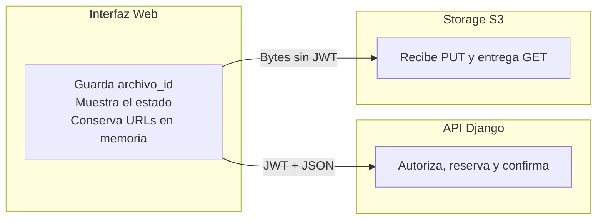

# CloudVault — Guía de Integración / Archivos

> **Documentación verificada al 7 de octubre de 2026**  
> **Estado de entrega:** Contrato y cliente validados con pruebas aisladas. La integración completa con los servicios compartidos y la interfaz real sigue pendiente. Los ejemplos del documento son ficticios.

---

## 01 / Visión General — Integración de archivos

Guía práctica para conectar la interfaz web con la carga y descarga autorizadas.

La API controla identidad, permisos, cuota y publicación. El navegador transfiere los bytes directamente al almacenamiento mediante enlaces temporales. Esta guía explica qué enviar, qué conservar y cómo reaccionar ante fallos.

### Arquitectura de Integración



### Flujo que debe seguir la interfaz

| 1. Iniciar | 2. Subir | 3. Confirmar | 4. Autorizar | 5. Descargar |
| :--- | :--- | :--- | :--- | :--- |
| **API: 201**<br/>Guardar ID y URL | **Storage: PUT**<br/>Enviar bytes | **API: 200**<br/>Esperar publicación | **API: 200**<br/>Pedir URL GET | **Storage: GET**<br/>Recibir archivo |

> [!IMPORTANT]
> **Momento de éxito:**  
> Un PUT exitoso solo acredita la transferencia. La interfaz debe mostrar el archivo como confirmado después de recibir **200** de la confirmación.

### Las tres rutas disponibles

| Método | Ruta | Éxito |
| :--- | :--- | :---: |
| `POST` | **Inicio:** `/api/v1/archivos/iniciar-carga/` | `201` |
| `POST` | **Confirmación:** `/api/v1/archivos/{id}/confirmar-carga/` | `200` |
| `GET` | **Descarga:** `/api/v1/archivos/{id}/descarga/` | `200` |

---

## 02 / API y Autorización — Preparar e iniciar una carga

Usar el origen de la API, por ejemplo `https://api.example.invalid`. La documentación interactiva existente está en `/api/docs/` y el esquema completo en `/api/schema/`.

El login existente recibe `correo` y `contrasena` en `POST /api/v1/auth/login/`. Tomar el access token de `data.tokens.access`. Su vigencia por defecto es 15 minutos; no hay una ruta de refresh disponible en el router revisado.

```http
Authorization: Bearer <ACCESS_TEMPORAL>
Accept: application/json
Content-Type: application/json
```

El JWT se envía a Django. El frontend no necesita claves de acceso S3, contraseña del bucket ni una clave interna del objeto.

### Solicitud de inicio

```http
POST /api/v1/archivos/iniciar-carga/
Content-Type: application/json
Authorization: Bearer <ACCESS_TEMPORAL>

{
  "nombre": "prueba.txt",
  "tamano_bytes": 5,
  "tipo_mime": "text/plain",
  "carpeta_id": "11111111-1111-4111-8111-111111111111"
}
```

> **Detalles de validación:**  
> `tamano_bytes` debe ser entero, no texto ni booleano. `carpeta_id` es opcional o `null`; una raíz exige que el servicio resuelva un ámbito inequívoco. La cuota se valida por organización. No enviar bucket, organización arbitraria, checksum o campos extra.

### Respuesta de inicio: HTTP 201

```json
{
  "data": {
    "archivo_id": "22222222-2222-4222-8222-222222222222",
    "url_subida": "https://storage.example.invalid/temporal?firma=ficticia",
    "metodo": "PUT",
    "encabezados": {
      "Content-Type": "text/plain"
    },
    "expira_en": "2030-01-01T00:00:00Z"
  }
}
```

> [!NOTE]
> **Dato que debe conservarse:**  
> `archivo_id` es la identidad para confirmar y descargar. No usar el identificador interno de sesión. Guardar la URL y los headers en memoria y utilizar el vencimiento recibido, en UTC.

---

## 03 / Transferencia y Publicación — Subir bytes y confirmar

Enviar el archivo original a `url_subida` con el método y los encabezados devueltos. Usar el body binario; no envolverlo en JSON ni `multipart/form-data`. La URL se usa completa, sin editar host, ruta, query ni firma.

### Ejemplo de PUT desde el navegador

En este fragmento, `inicio` es el objeto `data` de inicio y `archivo` es el `File` seleccionado. El código es una referencia para integrar en el cliente:

```javascript
const respuestaPut = await fetch(inicio.url_subida, {
  method: inicio.metodo,
  headers: inicio.encabezados,
  body: archivo,
  credentials: "omit",
  redirect: "error",
  referrerPolicy: "no-referrer"
});

if (!respuestaPut.ok) throw new Error("Falló la subida");
const etag = respuestaPut.headers.get("ETag");
```

No añadir `Authorization`/JWT ni cookies de Django al PUT. Conservar el ETag literalmente, incluidas las comillas. Si el navegador no puede leerlo, la confirmación admite `{}`; ETag no equivale a SHA-256.

### Confirmación: POST a Django con JWT

```http
POST /api/v1/archivos/{archivo_id}/confirmar-carga/
Content-Type: application/json
Authorization: Bearer <ACCESS_TEMPORAL>

{}
```

Alternativa con ETag disponible: `{"etag": "\"etag-ficticio\""}`. Sustituir `{archivo_id}` por el UUID recibido en inicio.

#### Respuesta de confirmación: HTTP 200

```json
{
  "data": {
    "id": "22222222-2222-4222-8222-222222222222",
    "nombre": "prueba.txt",
    "es_nuevo": true,
    "en_papelera": false
  }
}
```

> [!NOTE]
> **Después del 200:**  
> Mostrar el resultado confirmado y consultar las APIs compartidas de listado y cuota. Repetir la confirmación autorizada con el mismo ID devuelve el mismo resultado durable; `es_nuevo` no identifica el primer intento HTTP.

---

## 04 / Descarga y Recuperación — Usar enlaces temporales

Pedir `GET /api/v1/archivos/{archivo_id}/descarga/` a Django con JWT. No enviar body ni parámetros de consulta. Un usuario autorizado puede descargar aunque no haya realizado la carga.

#### Respuesta de descarga: HTTP 200

```json
{
  "data": {
    "url_descarga": "https://storage.example.invalid/final?firma=ficticia",
    "nombre": "prueba.txt",
    "expira_en": "2030-01-01T00:00:00Z"
  }
}
```

Usar `url_descarga` directamente en storage, sin JWT. La firma entrega el archivo como adjunto y `octet-stream`, con el nombre codificado por el backend. Al vencer, pedir una nueva autorización para el mismo archivo.

### Vigencia y límites por defecto

| Regla | Valor / aplicación |
| :--- | :--- |
| **Carga temporal** | Hasta 900 s; puede acortarse según el período de cuota. |
| **Descarga temporal** | Hasta 300 s. Tomar `expira_en` recibido en UTC. |
| **Tamaño operativo** | 1 GiB por archivo, además de la cuota organizacional. |
| **Emisiones aceptadas** | Inicio: 10 por actor / 60 s. Descarga: 30 por actor / 60 s. |

### Recuperar un fallo sin duplicar operaciones

* **Inicio perdido:** no reiniciar en bucle. El inicio no deduplica por `Idempotency-Key` y no existe una consulta pública para recuperar un ID que no se recibió.
* **Confirmación perdida:** conservar `archivo_id` y repetir la confirmación autorizada con el mismo body/ETag. Un 503 puede representar publicación ambigua; no autoriza otra copia, un DELETE ni una sesión nueva.

> [!WARNING]
> **Cancelación y revocación:**  
> Abortar el PUT local no libera la reserva en servidor. No hay ruta pública de cancelación o estado; el vencimiento y mantenimiento deben reconciliarla. Las URLs emitidas son capacidades temporales: quitar permisos no garantiza revocación instantánea ni corta transferencias ya iniciadas.

---

## 05 / Errores y Estado de Interfaz — Responder al resultado real

Los errores del módulo usan el envoltorio siguiente; `fields` puede contener listas de errores de campo. La autenticación conserva su formato propio.

```json
{
  "error": {
    "code": "CUOTA_EXCEDIDA",
    "fields": {}
  }
}
```

### Catálogo de Códigos de Error

| HTTP | Código | Acción del cliente |
| :---: | :--- | :--- |
| **400** | `VALIDATION_ERROR` | Corregir campos, ID, estado o vencimiento. |
| **401** | `NO_AUTENTICADO`<br>`TOKEN_INVALIDO` | Recuperar la sesión disponible y conservar la identidad del flujo. |
| **403** | `SIN_PERMISO` | Revisar permiso y destino; no probar carpetas al azar. |
| **404** | `NO_ENCONTRADO` | Recurso no accesible o no disponible; no deducir existencia para otro usuario. |
| **405** | `VALIDATION_ERROR` | Corregir método. Descarga usa GET; inicio y confirmación usan POST. |
| **409** | `CUOTA_EXCEDIDA` | Revisar capacidad, uso y reservas del plan real. |
| **429** | `RATE_LIMITED` | Esperar `Retry-After` cuando exista y acotar los intentos. |
| **500** | `ERROR_INTERNO` | Conservar ID y reportar etapa, status y código sin secretos. |
| **503** | `SERVICE_UNAVAILABLE` | Revisar dependencia/configuración y preservar el ID para reconciliación. |

> Confirmación no documenta 429 y descarga no documenta 409. Un fallo de red no demuestra que el servidor haya revertido la operación.

### Estados que conviene mostrar en UI

* **Preparando:** esperando inicio.
* **Subiendo:** enviando bytes.
* **Verificando:** PUT terminó y falta confirmación.
* **Confirmado:** confirmación respondió 200.
* **Pendiente de revisión:** respuesta perdida o publicación ambigua.

El listado y la cuota se refrescan después de confirmar, mediante sus APIs compartidas. No agregar una entrada confirmada únicamente porque PUT respondió 200.

---

## 06 / Preparación de la Integración — Comprobar el flujo completo

La entrega dispone de OpenAPI, ejemplos JSON y cliente ejecutable. Hay **327 pruebas locales aprobadas**, incluidas 14 de documentación/cliente. PostgreSQL privado y transporte HTTP loopback son reales; negocio, bucket y actor autorizado del recorrido están sustituidos explícitamente.

La validación anterior de Railway verificó S3, CORS y navegador, además de conexión SQL de solo lectura. Esto no certifica el flujo completo con React ni los servicios/SQL finales.

### Requisitos por Área

| Área | Condición necesaria |
| :--- | :--- |
| **Interfaz web** | Consumir las tres rutas y sustituir mocks; conservar ID, headers, UTC y errores. |
| **Servicios de negocio** | Proveedor real de permisos, destino, cuota, archivo, descarga y referencias. |
| **Base de datos** | Diario técnico, permisos, mapping de fechas y una sola autoridad de consumo. |
| **Ambiente** | Mantenimiento supervisado y CORS del origen frontend definitivo; prueba de reinicio desplegado pendiente. |

### CORS y manejo de datos temporales

API CORS y storage CORS son independientes. Storage debe permitir el origen exacto del frontend, PUT/GET, content-type y exposición de ETag. Se verificó el origen de ensayo `http://127.0.0.1:8765`; falta comprobar el origen definitivo.

Conservar enlaces firmados en memoria. No guardarlos en `localStorage`, logs, capturas o reportes. Django responde `no-store`/`no-referrer`. La interfaz no configura el bucket ni requiere sus credenciales.

### Ensayo reproducible

Desde `backend`, con API, carpeta y usuario de prueba ya preparados, definir `ALMACENAMIENTO_TOKEN_PRUEBA` en el entorno. El cliente crea 17 bytes sintéticos, verifica el recorrido y conserva el archivo; los valores del comando son ficticios:

```bash
python -m almacenamiento.cliente_integracion --ejecutar \
  --base-api https://api.example.invalid \
  --origen-storage https://storage.example.invalid \
  --carpeta-id 11111111-1111-4111-8111-111111111111
```

Validar juntos: carga/descarga y bytes, confirmación repetida, vencimientos, 401/403/409/429, fallo tras PUT, recuperación de ID y actualización de listado/cuota. Registrar fecha, versión, origen y resultado sin tokens o URLs.

> [!NOTE]
> **Material de referencia:**  
> * **Paquete:** `backend/almacenamiento/entrega/`  
> * **Archivos:** `openapi.json`, `ejemplos.json`, `README.md`, `dependencias.md`, `evidencia.md` y `verificacion.json`.  
> * **Contrato fuente:** `Contratos de API - CloudVault.pdf`.
